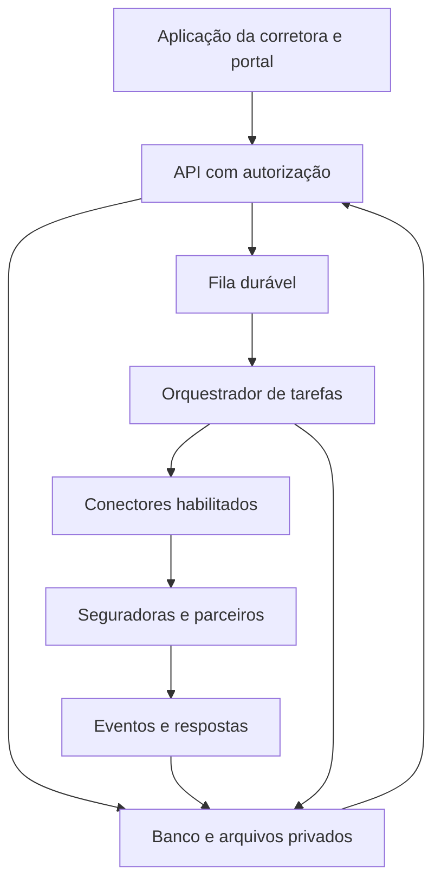

# Sistema de gestão de corretoras de seguros
## Pesquisa de mercado e especificação completa para desenvolvimento

**Versão:** 1.1  
**Data da pesquisa:** 03/10/2026  
**Atualização:** requisitos de credenciamento, credenciais e aba de configuração de empresas revisados em 03/10/2026.  
**Mercado considerado:** Brasil  
**Formato de uso:** documento de produto, arquitetura, regras de negócio e instruções para desenvolvimento por VibeCode ou equipe técnica.  
**Nome comercial:** configurável. Não impor uma marca definitiva nem presumir disponibilidade de domínio.

> Desenvolver uma plataforma que centralize o trabalho da corretora: relacionamento com clientes, consulta de ofertas, comparação de coberturas, elaboração e transmissão de propostas, acompanhamento da contratação, apólices, endossos, renovações, parcelas, comissões, repasses, sinistros e gestão financeira. O motor deve consultar o maior conjunto possível de seguradoras e produtos **efetivamente acessíveis, elegíveis e autorizados para aquela corretora**, com transparência sobre a abrangência da pesquisa.

**Distinção de leitura:** a seção de mercado apresenta informações publicadas pelas fontes consultadas. As demais seções definem requisitos propostos para o novo sistema, e não funcionalidades comprovadas dos fornecedores. Os números dos exemplos financeiros são fictícios e servem para validar regras.

---

## 1. Análise de mercado

### 1.1 Referências encontradas

| Solução | Recursos publicados relevantes | Abrangência anunciada | Referência pública de preço | Implicação para o projeto |
|---|---|---|---|---|
| TEx / TELEPORT | Multicálculo, transmissão de propostas, carteira, importações e controle de comissões e repasses | A página consultada informa até 22 seguradoras e mais de 50 produtos em determinados ramos | Não foi identificado preço comercial público confiável na página consultada; solicitar proposta | Comparação e transmissão integradas já são referências de experiência [F1] |
| Quiver Mult | Cálculos simultâneos, renovações e previsão de comissões; informa integração por API e robô | A página consultada menciona até 18 seguradoras no automóvel | Sob consulta na página consultada | Prever conectores de diferentes tipos e gestão após a venda [F2] |
| Agger / Aggilizador / ONE | Multicálculo; o ONE reúne carteira, documentos, financeiro e relacionamento | Publica mais de 40 seguradoras e 15 ramos | Aggilizador: R$ 98 por licença/mês; ONE: R$ 198 por licença/mês, conforme página consultada | A abrangência de multicálculo é um concorrente relevante; avaliar parceria antes de desenvolver dezenas de conectores [F3] |
| Segfy | Gestão de apólices, propostas, sinistros, renovações, comissões, parcelas e multicálculo | Seguradoras e produtos conforme contratação | Gestão: R$ 187/mês por assinatura, com condições para usuários adicionais. Multicálculo avulso: R$ 35,90/mês com 50 cálculos e excedente de R$ 0,72 | Existe concorrência com entrada acessível; automação operacional e conciliação precisam justificar o novo produto [F4] |

**Como interpretar os dados:** são informações comerciais dos próprios fornecedores, sem auditoria independente. Não comparar os totais como se todos cobrissem os mesmos ramos, produtos, credenciamentos e operações. Quiver e Agger também apresentam soluções conjuntas; não devem ser contadas como universos independentes de seguradoras.

**Como interpretar os preços:** os valores são referências de uso das plataformas publicadas na data da pesquisa, sujeitos a alteração e condições comerciais. Uma assinatura comum **não comprova direito a API, integração externa, uso por múltiplas corretoras, revenda ou marca própria**. Esses direitos e seus custos devem ser confirmados em contrato.

### 1.2 Conclusões para o produto

1. Multicálculo é parte central da oferta atual, mas precisa ser acompanhado de gestão da carteira e pós-venda.
2. Desenvolver um ERP completo e dezenas de integrações ao mesmo tempo aumenta o custo de implantação e manutenção.
3. Recomenda-se construir o núcleo próprio de gestão e uma camada independente de conectores, começando com um parceiro de multicálculo, se houver licença adequada, e APIs diretas nos produtos estratégicos.
4. A vantagem proposta deve estar em reduzir digitação, controlar pendências, conciliar valores, recuperar renovações e registrar evidências do atendimento.
5. O sistema deve continuar útil quando uma seguradora não permitir cotação automática: a operação passa para uma fila assistida, com formulário, documentos, responsável e acompanhamento.
6. Saúde, riscos empresariais complexos, garantia e outros produtos podem depender de análise comercial ou subscrição. Não prometer resposta instantânea para todo ramo.

Essas conclusões são recomendações de projeto inferidas da pesquisa, não estimativas de participação de mercado ou garantia de desempenho.

### 1.3 Validação comercial antes do lançamento

Entrevistar corretoras de diferentes portes e validar:

- Tempo gasto em cotação, renovação, importação e conferência de comissões.
- Seguradoras e ramos que concentram a carteira.
- Sistemas já utilizados e dificuldade de exportação de dados.
- Percentual das propostas que exige análise manual.
- Volume mensal de cotações, apólices, parcelas, extratos e mensagens.
- Disposição a pagar por usuário, corretora, cotação e automação.
- Necessidade de integração com assessorias, filiais e produtores.
- Regras comerciais e financeiras que mais geram retrabalho.

Medir esses pontos em piloto. Não declarar economia de tempo ou aumento de vendas sem dados observados.

## 2. Objetivos e princípios obrigatórios

### 2.1 Objetivos

- Cadastrar uma informação uma vez e reaproveitá-la com revisão e controle de atualização.
- Consultar múltiplas fontes em paralelo e consolidar as respostas.
- Elaborar propostas claras, com preço, coberturas, franquias, limitações e condições de pagamento.
- Acompanhar a proposta até a aceitação e documentação da contratação.
- Gerenciar vigências, parcelas, comissões, repasses e estornos.
- Detectar divergências entre cotação, proposta e documento emitido.
- Organizar sinistros, endossos, contatos e solicitações.
- Automatizar a rotina repetitiva com regras configuráveis e auditáveis.
- Permitir operação de uma corretora ou oferta como SaaS para várias corretoras independentes.

### 2.2 Regras que não podem ser violadas

1. Não apresentar dados simulados como cotações reais.
2. Não inventar prêmio, aprovação, cobertura, franquia, comissão ou status de pagamento.
3. Não anunciar pesquisa em todas as seguradoras se a integração cobre apenas parte do mercado.
4. Não transformar falha de comunicação em recusa comercial ou inexistência de oferta.
5. Não considerar manifestação do cliente, transmissão, aceitação e emissão como o mesmo evento.
6. Não garantir cobertura a partir de uma cotação; registrar a condição contratual e evidência aplicável.
7. Não contabilizar o prêmio do seguro como receita da corretora.
8. Não confundir pagamento do segurado com recebimento da comissão.
9. Não modificar registros financeiros conciliados sem lançamento de ajuste e trilha de auditoria.
10. Não permitir acesso a dados de outra corretora por alteração de URL, identificador ou requisição.
11. Não colocar credenciais de seguradoras, chaves administrativas ou dados de cartão no navegador.
12. Não selecionar ofertas apenas pela maior comissão.

## 3. Escopo, organização e perfis

### 3.1 Organização

- `tenant`: corretora contratante e limite principal de isolamento.
- Corretora: razão social, nome comercial, CNPJ, registro aplicável, responsável e contatos.
- Unidades/filiais: organização operacional dentro do tenant, com CNPJ e credenciamentos próprios quando necessário.
- Equipes: comercial, renovação, emissão, sinistros, financeiro e atendimento.
- Produtores, assessorias e parceiros: participantes das operações e dos acordos de repasse.
- Clientes: pessoas físicas, jurídicas, grupos empresariais, famílias e respectivos vínculos.
- Um usuário pode participar de mais de um tenant somente por vínculos explícitos; a sessão opera em um tenant por vez.

### 3.2 Perfis e permissões

| Perfil | Acesso esperado | Restrições principais |
|---|---|---|
| Master da plataforma | Assinaturas SaaS, limites, saúde operacional e configurações globais | Acesso ao conteúdo da corretora somente por procedimento de suporte autorizado e auditado |
| Administrador da corretora | Usuários, unidades, regras, integrações e relatórios do tenant | Não administra outras corretoras |
| Gestor comercial | Funil, metas, carteira, cotações e distribuição de oportunidades | Financeiro e dados sensíveis conforme concessão |
| Corretor/produtor | Carteira e oportunidades atribuídas, cotações e atendimento | Visualização de comissão, exportação e transmissão configuráveis |
| Operação/emissão | Propostas, documentos, vistorias, pendências e emissão | Não altera acordos de comissão sem permissão |
| Financeiro | Comissões, repasses, conciliação, contas e parcelas | Questionários sensíveis fora do seu escopo |
| Sinistros/pós-venda | Sinistros, endossos, assistências e comunicação | Recebe somente os dados necessários à operação |
| Auditor/leitura | Evidências, relatórios e trilhas autorizadas | Sem alterações ou operações externas |
| Cliente/segurado | Documentos, propostas, parcelas e solicitações próprias | Nunca visualiza comissão interna, outros clientes ou dados restritos |

Permissões granulares: consultar, criar, editar, exportar, excluir quando cabível, transmitir, aprovar, conciliar, pagar, estornar, acessar informações sensíveis e administrar credenciais. Aplicar também limites por unidade, carteira e valor.

## 4. Experiência visual e navegação

### 4.1 Diretrizes

- Interface limpa, profissional, responsiva e inteiramente em português do Brasil.
- Atalhos para nova cotação, novo cliente, renovação, baixa de comissão e nova solicitação.
- Busca global por nome, CPF/CNPJ parcialmente mascarado, apólice, proposta, placa e protocolo, respeitando permissões.
- Listas com filtros salvos, colunas configuráveis, paginação e seleção em massa.
- Edição em massa com prévia, validação, limite de escopo e relatório das alterações.
- Datas no formato brasileiro, moeda BRL e fuso de exibição por corretora.
- Estados de carregamento, ausência de integração, erro, dados insuficientes e resultado parcial explícitos.
- Ações destrutivas e alterações financeiras com confirmação contextual e motivo.
- Acessibilidade por teclado, contraste adequado, rótulos de campo e estados que não dependam apenas de cor.
- Funcionamento em celular para consulta, coleta de documentos e atendimento; operações densas também otimizadas para desktop.

### 4.2 Menu funcional

1. Painel inicial.
2. Agenda, tarefas e pendências.
3. CRM e oportunidades.
4. Clientes e grupos.
5. Central de cotações e multicálculo.
6. Comparativos e propostas.
7. Transmissão e emissão.
8. Apólices e certificados.
9. Endossos.
10. Renovações.
11. Parcelas dos seguros.
12. Comissões a receber.
13. Repasses a produtores/parceiros.
14. Financeiro da corretora.
15. Sinistros e assistências.
16. Planos, produtos e coberturas.
17. Seguradoras e integrações.
18. Documentos e importações.
19. Comunicação e automações.
20. Relatórios e indicadores.
21. Portal do cliente.
22. Configurações da corretora.
23. Administração Master, quando o perfil permitir.

## 5. CRM, cadastro e relacionamento

### 5.1 Clientes e vínculos

Cadastrar, conforme finalidade e necessidade:

- Nome/razão social, CPF/CNPJ, contatos, endereço e identificadores internos.
- Representante legal, contatos autorizados e canais preferidos.
- Relação entre contratante, segurado, pagador, estipulante e beneficiário; não presumir que sejam a mesma pessoa.
- Empresas do grupo, dependentes, famílias e bens seguráveis.
- Carteira, unidade, corretor responsável e origem do relacionamento.
- Dados de contato verificados, preferências de comunicação e bloqueios de marketing.
- Documentos com tipo, validade, versão, origem e nível de acesso.
- Finalidade e base legal do tratamento, autorizações específicas e histórico de consentimentos quando utilizados.
- Registro de alterações de dados usados em cotações anteriores.

Detectar duplicidade por identificadores normalizados dentro do tenant. Sugerir união de cadastros, com revisão humana e preservação dos vínculos e evidências; não unir automaticamente homônimos.

### 5.2 Oportunidades

Funil inicial configurável:

`Novo contato → Qualificação → Coleta de dados → Cotação → Comparativo → Negociação → Autorização do cliente → Transmissão → Acompanhamento da contratação → Ganho/Perdido`.

Cada oportunidade deve conter ramo, necessidade, valor estimado quando conhecido, origem, responsável, próxima ação, documentos pendentes e motivo de perda. Uma oportunidade pode gerar várias rodadas de cotação e versões de proposta.

### 5.3 Atendimento

- Linha do tempo unificada de e-mails, mensagens, telefonemas registrados, tarefas e documentos.
- Agenda com responsável, prazo, prioridade e regras de escalonamento.
- Histórico de reclamações, compromissos assumidos e resoluções.
- Formulários por link autenticado ou token temporário para atualização cadastral e coleta de dados.
- Campanhas de relacionamento somente aos contatos habilitados para a finalidade.
- Identificação de possibilidades de venda cruzada a partir de necessidades registradas; exigir validação comercial e adequação ao cliente.

## 6. Cadastro de seguradoras, operadoras, planos e produtos

### 6.1 Seguradoras e fornecedores

- Razão social, CNPJ, marca, grupo econômico e código oficial quando aplicável.
- Tipo de instituição: seguradora, operadora de saúde, administradora de benefícios, entidade de previdência ou fornecedor tecnológico.
- Cadastro e situação consultados em fonte oficial, com data, evidência e rotina de revisão.
- Ramos atendidos, regiões, canais comerciais, contatos e assistência.
- Credenciamentos por corretora, filial e produtor, com código e vigência.
- Acordos comerciais, comissões, bonificações, regras de pagamento e estorno.
- Capacidades de integração por produto e operação; não presumir que uma API de cotação permita emissão ou consulta financeira.
- Ambiente: não configurado, sandbox, homologação, produção, suspenso ou descontinuado.

### 6.2 Catálogo versionado

Para cada produto/plano, armazenar:

- Instituição responsável, ramo/modalidade e nome comercial.
- Código do produto no fornecedor e registro/processo oficial quando existente e aplicável.
- Versão comercial, versão dos documentos e datas de início/fim de validade.
- Público elegível, território, faixa de risco, tipo de contratação e documentos necessários.
- Coberturas básicas e opcionais, exclusões, limites, sublimites e participações obrigatórias.
- Franquias por cobertura, carências quando cabíveis e assistências.
- Formas de pagamento, parcelamentos e regras de renovação.
- Questionário de risco e condições gerais/especiais/particulares.
- Origem, data de atualização e responsável pela validação.
- Status: rascunho, validado, ativo, vencido, retirado de comercialização ou pendente de revisão.

O catálogo informa características conhecidas; **preço personalizado só deve ser tratado como cotação quando houver retorno válido do fornecedor ou cotação formal anexada**.

### 6.3 Ramos e dados específicos

| Ramo/módulo | Informações específicas | Automação pretendida, condicionada ao conector |
|---|---|---|
| Auto, moto e caminhão | Veículo, utilização, condutores, CEP de circulação/pernoite, bônus e histórico declarado | Multicálculo, alternativas de franquia, transmissão e vistoria |
| Frotas | Lista versionada de veículos, movimentações, utilização e critérios por item | Importação em massa e cotações individuais ou consolidadas conforme produto |
| Residencial | Endereço, ocupação, construção, valores e riscos | Multicálculo e comparação de coberturas |
| Condomínio | Características da edificação, áreas, unidades, responsável e valores | Cotação integrada ou coleta e envio assistidos |
| Empresarial/patrimonial | Atividade, locais, estoque, máquinas, valores e proteções declaradas | Cotação integrada ou análise de subscrição |
| Vida individual/acidentes pessoais | Proponente, capitais, ocupação, beneficiários e dados exigidos pelo produto | Cotação e coleta protegida de informações |
| Vida em grupo | Estipulante, grupo, elegibilidade, capitais e movimentações | Gestão de vidas, certificados e faturamento quando disponível |
| Saúde e odontológico | Operadora/plano, contratação, idades, município, elegibilidade, rede, coparticipação e acomodação | Comparação por tabela vigente ou API autorizada; implantação e movimentações |
| Viagem | Destino, datas, viajantes, coberturas e condições especiais | Cotação e emissão quando autorizadas |
| Responsabilidade civil/profissional | Atividade, faturamento, limites, retroatividade e condições claims-made quando aplicáveis | Questionário e análise especializada |
| D&O e riscos cibernéticos | Estrutura empresarial, limites e questionários próprios | Encaminhamento técnico e acompanhamento de subscrição |
| Equipamentos/bicicleta | Bem, modelo, valor, uso, identificação e documentos | Cotação e inspeção conforme produto |
| Rural | Atividade, localização, área, cultura/bens, safra e exposições | Gestão documental e consulta especializada |
| Transportes | Operação, mercadoria, trajetos, limites e averbações | Integração de cotações e averbação somente com contrato específico |
| Garantia | Tomador, obrigação garantida, beneficiário e análise de crédito | Solicitação e acompanhamento de análise |
| Fiança locatícia | Locação, partes, imóvel, valores e garantias | Cotação/análise conforme integração |
| Previdência aberta | Produto, contribuições, beneficiários e regime informado pelo fornecedor | Gestão e jornadas específicas; não tratar como seguro de danos |

Permitir novos ramos sem reescrever o núcleo. Capitalização ou proteção patrimonial mutualista, se futuramente incluídas, exigem módulos próprios e identificação clara de sua natureza; não apresentar produtos diferentes como equivalentes a seguro.

### 6.4 Saúde e odontológico

Saúde suplementar deve ter configuração e regras específicas. O Guia de Planos da ANS é referência pública de consulta; sua existência não comprova API comercial de cotação disponível para o projeto [F10].

Requisitos do módulo:

- Registro de operadora e plano, região, segmentação, contratação e acomodação.
- Tabelas de preço por faixa etária, vigência, região, modalidade e número de vidas, com origem e validação.
- Elegibilidade, mínimos de vidas, dependentes e documentos de implantação.
- Coparticipação, franquias quando previstas, limites e regras do produto.
- Rede referenciada com fonte e data; separar informação declarada de rede confirmada.
- Reajustes previstos e efetivamente comunicados; não inventar percentual futuro.
- Movimentações, exclusões, inclusões e faturamento mensal quando autorizado.
- Jornada de portabilidade e documentação conforme regras aplicáveis, sem promessa automática de aceitação.
- Dados de saúde em área restrita. Não usar informação clínica para campanhas ou seleção de riscos indevida.

## 7. Estratégia de integrações e consulta automática

**Implementação obrigatória desta seção:** criar a aba **Seguradoras e Integrações**, com botão **Adicionar empresa** e assistente de configuração detalhado no **Anexo C**. Permitir cadastrar uma empresa sem integração pronta, mas ativar operações automáticas somente com conector, credenciamento, autorização e testes correspondentes.

### 7.1 Fontes identificadas e limites

| Fonte | Evidência consultada | Possível uso | Condição de implantação |
|---|---|---|---|
| Porto Seguro | Portal documenta cadastro, aprovação de APP, tokens e ambientes de teste | Conectores para os produtos liberados ao parceiro | Validar APIs efetivamente autorizadas, contrato e credenciamento [F5] |
| Tokio Marine | Portal público de integração apresenta jornadas de vendas, incluindo auto e residencial | Conector direto nos produtos habilitados | Obter documentação, credenciais e homologação; catálogo completo não foi validado [F6] |
| Bradesco Seguros | Portal empresarial apresenta cotação, efetivação, pagamento, consulta e endosso | Jornada de seguro empresarial | Confirmar acesso de produção, documentação e escopo comercial [F7] |
| BB/Brasilseg | Página comercial de API descreve produtos de seguros e requisitos de parceria | Distribuição dos produtos habilitados | Exige condições de parceria; não tratar como API pública irrestrita [F8] |
| Multicálculo contratado | Fornecedores de mercado apresentam consultas em diversas companhias | Ampliar a cobertura com um único contrato de integração | Confirmar API/SDK, direitos de uso, credenciais e cobrança; plataforma comum não basta [F1], [F2], [F3], [F4] |
| Open Insurance | SUSEP descreve compartilhamento consentido e participantes autorizados/credenciados; portal técnico lista APIs de cotação e outras jornadas | Dados públicos e jornadas consentidas através da modalidade de participação adequada | Confirmar escopo, consentimento, certificados, homologação e participação/parceiro habilitado [F9] |
| Arquivos e operação assistida | Documentos formalmente recebidos da seguradora ou lançados pela equipe | Complementar ramos sem integração | Registrar fonte, validade, responsável e distinguir resposta manual de automática |

Não foi comprovado acesso comercial em produção para este projeto. A tabela identifica caminhos verificáveis para avaliação, e não integrações prontas.

### 7.2 Prioridade de implementação

1. API oficial direta autorizada.
2. Parceiro de multicálculo com contrato que permita integração ao sistema.
3. Open Insurance por estrutura/parceiro habilitado, conforme operação.
4. Importação de arquivos oficiais e cotação assistida.
5. Automação autorizada de portal, como alternativa específica quando permitida pelo fornecedor.

Automação de portal deve respeitar termos, autorização da corretora, limites e mecanismos de autenticação. Não contornar CAPTCHA, MFA, bloqueios ou restrições de acesso. Quando a autenticação exigir intervenção, pausar e criar tarefa para o responsável. Prever executor compatível com o portal e com a infraestrutura; não pressupor execução de navegador em qualquer função serverless.

### 7.3 Matriz de capacidades

Controlar uma matriz por **tenant + credenciamento + fornecedor + produto + versão + ambiente**:

| Capacidade | Estados possíveis |
|---|---|
| Consulta de produtos | Não disponível / contratada / homologada / ativa / degradada |
| Cotação personalizada | Idem, com restrições por perfil de risco |
| Alteração de coberturas/comissão | Somente parâmetros aceitos pelo fornecedor |
| Transmissão de proposta | Independente da cotação |
| Consulta de proposta e aceitação | Independente da transmissão |
| Download de apólice/certificado | Independente da aceitação |
| Consulta de parcelas e boletos | Independente da emissão |
| Consulta de comissão/extrato | Independente das parcelas do segurado |
| Endosso, cancelamento e sinistro | Permissão específica para cada operação |
| Webhooks ou consulta periódica | Registrar modalidade, frequência e limitações |

A interface só habilita operações cuja capacidade estiver homologada e autorizada em produção. Recursos sem contrato aparecem como pendentes de integração, com alternativa operacional.

### 7.4 Open Insurance

- Separar dados públicos de produto de dados pessoais e iniciação de serviços.
- Dados pessoais/jornadas consentidas devem utilizar o fluxo e a participação previstos para o ecossistema; não reutilizar uma autorização genérica do CRM como consentimento Open Insurance.
- Registrar titular/representante, finalidade, escopo, destinatários, validade, status e revogação.
- Verificar consentimento antes de enviar cada solicitação e novamente ao executar uma tarefa enfileirada.
- Revogação impede novos usos abrangidos; retenção de registros já existentes segue finalidade e obrigações aplicáveis.
- Usar a versão técnica homologada para o participante, acompanhando mudanças e retirada de versões.
- Não presumir que disponibilização de catálogo equivale a preço personalizado, nem que uma jornada de envio de lead retorna cotação firme.

### 7.5 Registro, credenciamento e credenciais: etapas diferentes

Separar no cadastro e na interface:

1. **Habilitação da corretora:** dados da empresa, responsável técnico, registro e segmentos de atuação aplicáveis. O serviço oficial de registro da SUSEP descreve o cadastro da pessoa jurídica pelo responsável técnico e o envio do ato constitutivo [F18]. A consulta oficial permite conferir situação e emitir certidão; informa que a operação exige cadastro ativo [F19].
2. **Credenciamento comercial:** vínculo da corretora/filial/produtor com aquela instituição, códigos comerciais, produtos autorizados e acordos pertinentes.
3. **Integração técnica:** aplicativo/parceiro aprovado, autorização das APIs ou do multicálculo, credenciais por ambiente, certificados e homologação conforme fornecedor.

Registro SUSEP, código comercial, senha de portal e credencial de API têm funções diferentes. O assistente explica o que falta e apresenta o próximo passo. Não presumir que um código SUSEP funciona como chave de API.

### 7.6 Requisitos verificados por caminho de integração

| Empresa/caminho | Requisito público confirmado | Campos ou recursos a prever | O que deve ser confirmado na contratação |
|---|---|---|---|
| Porto — API direta | Cadastro e APP aprovados; autorização e ambientes; homologação sujeita a acordo de confidencialidade [F5] | `Client ID`, `Client Secret`, ambiente e APIs liberadas; token gerado no servidor [F20] | Produtos, código da corretora, produção, limites e direitos da aplicação |
| Bradesco — API direta RE | Solicitação de credenciais por interlocução comercial/TI e par `client-id`/`client secret` [F21] | Autenticação OAuth e requisitos de conexão do produto | Escopo, códigos comerciais, endpoints e ambientes efetivamente liberados |
| Bradesco — certificado da integração consultada | A documentação de seguro empresarial prevê mTLS e certificado de produção ICP-Brasil A1 [F22] | Referência segura de certificado/chave, validade e registro no fornecedor | Política atual do produto e titular do certificado; não é requisito universal de toda seguradora |
| Tokio Marine | Cadastro comercial solicita identificação, CPF/CNPJ, código SUSEP/IBRACOR e dados do responsável [F23]; há portal de integração [F6] | Cadastro, código comercial, vínculo e credenciais definidas pela documentação liberada | Tipo exato de autenticação, produtos e aprovação técnica; campos de API não foram confirmados publicamente |
| BB/Brasilseg | A página da API informa cadastro/parceria e condições comerciais, incluindo conta BB e contrato/cadastro ativo com Brasilseg [F8] | Referência da parceria, produto, conta comercial quando exigida e autorização técnica | Credenciais e documentação específicas; o requisito de conta refere-se ao parceiro dessa jornada |
| Multicálculo parceiro | Requisitos variam por companhia e pelo parceiro contratado | Conexão com o parceiro e vínculos das companhias, com campos dinâmicos | Licença de integração externa e condições por tenant, além da ativação de cada companhia |
| Pier via Segfy/Multify, como exemplo de configuração | A ajuda da Segfy orienta gerar token de multicálculo no portal da Pier [F24] | Token específico e demais campos previstos nesse conector | Não extrapolar esse procedimento para uma API direta própria da Pier |
| Bradesco via Segfy, como exemplo de configuração | A ajuda da Segfy prevê vínculo do provedor no portal e dados dependentes do tipo de login [F25] | Checklist de vínculo e campos próprios do parceiro | Não substituir o nome do provedor autorizado pela marca do novo sistema nem presumir revenda permitida |
| Open Insurance | Compartilhamento consentido entre participantes autorizados/credenciados [F9] | Participante/parceiro, autorização, consentimentos e recursos técnicos homologados | Modalidade de participação, escopo, certificados e direitos da corretora |

São exigências publicadas para os caminhos identificados, não uma declaração de que a corretora deste projeto já possui autorização. Páginas públicas podem conter requisitos de versões ou produtos específicos; cada template registra fonte, data de verificação e versão validada.

### 7.7 Documentação comum e documentação condicionada

**Cadastro reutilizável da corretora:** razão social, CNPJ, endereço, contatos comerciais, responsável técnico, registro aplicável e segmentos autorizados. Esses dados são recuperados do tenant; o usuário não precisa digitá-los novamente a cada empresa.

**Documentos conforme etapa e fornecedor:** ato constitutivo, comprovação de registro, cadastro comercial, procuração/representação, acordo de parceria, termos de API/NDA e aprovação de produção. Documentos bancários, fiscais ou adicionais só aparecem quando exigidos pelo fornecedor ou pela operação específica.

Não exigir certificado A1, contrato idêntico ou a mesma lista de documentos para toda empresa. Não coletar senha gov.br: apresentar o link oficial para o responsável concluir o procedimento e anexar a evidência pertinente.

### 7.8 Condição de ativação

Salvar cadastro, autenticar tecnicamente e estar autorizado a operar são resultados separados. Uma conexão só entra no multicálculo real quando estiver ativa **para aquele tenant, credenciamento, produto, capacidade e ambiente**.

O assistente deve validar a disponibilidade do adaptador e do acesso comercial antes de solicitar segredos. Sem conector disponível, cadastrar a empresa, habilitar o fluxo assistido e permitir solicitar avaliação de integração.

### 7.9 Gestão simplificada e contínua

Permitir retomar configuração, consultar pendências, testar novamente, atualizar/revogar credenciais, pausar consultas e acompanhar sincronizações. Renovar tokens de curta duração automaticamente conforme protocolo; não solicitar ao usuário colar um token novo a cada expiração quando o conector permite geração automática.

Para a API de autorização Porto consultada, a documentação informa token de uma hora e recomenda reutilização durante sua validade [F20]. Implementar o prazo a partir do retorno e da política do conector, sem adotar uma hora como validade universal.

## 8. Motor de multicálculo e comparação

### 8.1 Preparação da pesquisa

O corretor informa cliente, ramo, risco, necessidade, vigência pretendida e coberturas mínimas. O sistema:

1. Recupera o cadastro e apresenta dados desatualizados para revisão.
2. Obtém somente os campos necessários ao ramo e às fontes escolhidas.
3. Valida preenchimento, formato, elegibilidade e consistência.
4. Não preenche respostas desconhecidas com um valor que facilite a aceitação do risco.
5. Mostra seguradoras/produtos elegíveis e motivos de exclusão: credenciamento, região, perfil, produto indisponível ou capacidade ausente.
6. Permite consultar todas as fontes elegíveis habilitadas ou uma seleção específica.
7. Exibe destinatários previstos e atende à autorização/base legal aplicável ao compartilhamento.
8. Cria uma rodada imutável com versão do questionário, dados, coberturas, preferências, regras comerciais e autor.

### 8.2 Cenários

Gerar cenários conforme a necessidade do cliente:

- Coberturas mínimas solicitadas.
- Proteção ampliada.
- Alternativas de franquia e assistência.
- Valores diferentes de limite, somente quando adequados e explicitamente identificados.
- Parcelamentos retornados pelo fornecedor.

Consultar primeiro um cenário adequado em todas as fontes elegíveis. Usar variantes adicionais com limites de custo, volume e autorização. Não multiplicar combinações sem necessidade; usar os recursos de múltiplas opções da API quando disponíveis.

### 8.3 Execução assíncrona

1. Criar solicitação de cotação e tarefas por fonte/produto/cenário.
2. Reservar orçamento e cota de consumo antes das chamadas cobradas.
3. Resolver credenciais exclusivamente no servidor.
4. Executar as tarefas em paralelo com limites por credencial, fornecedor e tenant.
5. Respeitar timeouts, limites comerciais e limites de infraestrutura.
6. Exibir resultados à medida que chegam, sem depender do fechamento de todas as tarefas.
7. Repetir somente falhas transitórias seguras, com espera progressiva e aleatoriedade; evitar cobrança duplicada e saturação.
8. Bloquear temporariamente conectores instáveis e informar indisponibilidade.
9. Tratar callbacks tardios pela identificação da rodada e sua versão; não misturá-los com uma nova pesquisa.
10. Cancelar tarefas ainda não iniciadas quando a rodada for cancelada, preservando histórico e resultado conhecido das chamadas já enviadas.
11. Permitir retomada após o fechamento da tela ou queda da conexão.
12. Consolidar resultados automáticos e manuais com origem identificada.

### 8.4 Estados de retorno

| Estado | Significado | Ação |
|---|---|---|
| Aguardando/executando | Solicitação ainda em curso | Acompanhar |
| Cotação válida | Retorno formal utilizável, dentro da validade | Comparar e selecionar |
| Valor indicativo | Simulação/tabela/estimativa identificada como tal | Solicitar confirmação antes da contratação |
| Dados insuficientes | Faltam informações exigidas | Coletar e executar nova versão |
| Análise de subscrição | Fornecedor exige análise | Abrir tarefa e acompanhar |
| Recusa informada | Resposta expressa do fornecedor | Registrar motivo e protocolo |
| Fonte indisponível | Problema técnico confirmado | Repetir de forma controlada ou usar alternativa |
| Tempo excedido | Não houve resposta dentro do orçamento de espera | Informar pesquisa parcial e permitir acompanhamento |
| Autorização expirada | Credencial/consentimento perdeu validade | Regularizar antes de consultar |
| Resultado indeterminado | Não é possível confirmar o que o fornecedor processou | Consultar protocolo antes de repetir operação sensível |
| Incompatível | Não atende aos parâmetros exigidos | Mostrar diferenças; não classificar como equivalente |

Falha técnica, timeout e ausência de resposta nunca são apresentados como recusa da seguradora.

### 8.5 Normalização de resultados

Preservar o retorno original protegido e criar uma representação comparável com:

- Instituição, produto, canal comercial e credenciamento usados.
- Identificadores da cotação, rodada, cenário e proposta externa quando existentes.
- Data/hora, validade, versão da API, versão de mapeamento e condições.
- Risco declarado e versão do questionário.
- Prêmio base/comercial, taxas, tributos e total, com definição de cada campo na fonte.
- Componentes desconhecidos como `null` ou “não informado”; nunca como zero.
- Coberturas, limites, franquias, participação obrigatória, sublimites e exclusões.
- Assistências, carências quando existentes e condições adicionais.
- Opções de pagamento com entrada, parcelas, vencimentos, juros/taxas e total por opção.
- Comissão retornada ou condição comercial interna, com fonte e nível de confirmação.
- Exigências de vistoria, documentos, análise e cobertura provisória quando formalmente indicada.

Não impor uma equação universal para “prêmio líquido”: cada conector deve documentar como os campos da seguradora correspondem ao modelo interno. Validar as identidades financeiras que forem expressamente definidas para aquele produto.

### 8.6 Deduplicação e abrangência

- Contar seguradoras por identidade jurídica apropriada, com marcas e canais vinculados.
- Registrar duas respostas da mesma seguradora por fontes diferentes, sem contar duas seguradoras.
- Não eliminar alternativas com condição comercial diferente apenas porque a marca é igual.
- Deduplicar oferta somente quando risco, produto, coberturas, vigência, canal, credenciamento e condições forem equivalentes.
- Preservar valores divergentes e pedir confirmação; não substituir automaticamente pelo menor retorno.
- Medir separadamente fornecedores técnicos, seguradoras consultadas, produtos, cenários e ofertas.

Exemplo fictício de resumo:

> 18 seguradoras elegíveis; 15 consultadas automaticamente; 11 retornaram cotação válida; 2 exigem análise; 2 estão sem resposta; 3 ficaram para consulta assistida. Comparação parcial, atualizada às 14h35.

Não apresentar esse exemplo como cobertura disponível do sistema antes da homologação dos conectores.

### 8.7 Comparação técnica e comercial

Tabela lado a lado com prêmio total, pagamento, coberturas, limites, franquias, assistências e diferenças relevantes.

- Filtrar primeiro pelos requisitos indispensáveis do cliente.
- Separar ofertas equivalentes, parcialmente equivalentes e incompatíveis.
- Não comparar parcela mensal com preço anual sem mostrar o total e o período.
- Não reduzir todas as franquias a um único número; detalhar por cobertura e evento.
- Em plano de saúde, considerar modalidade, rede, acomodação, coparticipação e abrangência.
- Destacar expressões diferentes sem assumir equivalência jurídica.
- Preservar campos não informados e permitir conferência no documento fonte.
- Sinalizar descontos condicionais, cobertura parcial, limites inferiores e validade próxima.
- Exibir pelo menos as opções adequadas de menor custo, melhor aderência e maior proteção, quando houver evidência suficiente para essa classificação.

Pontuação sugerida e configurável, **somente após os requisitos mínimos**: aderência às coberturas 45%, custo total 30%, adequação de franquias 15% e assistências solicitadas 10%. É uma regra interna de projeto, não um índice oficial. Não incluir comissão como critério de benefício ao cliente. Explicar pesos, dados usados e campos desconhecidos; permitir decisão fundamentada do corretor.

## 9. Propostas, autorização e contratação

### 9.1 Documento de comparação ao cliente

Gerar PDF e versão web com:

- Identificação da corretora e responsável.
- Dados necessários do cliente/risco, sem exposição excessiva.
- Data, validade e referência das cotações.
- Ofertas escolhidas, prêmio total e total por forma de pagamento.
- Coberturas, limites, franquias, participações, carências e assistências relevantes.
- Diferenças, exclusões e condições que merecem decisão do cliente.
- Documentos oficiais e condições contratuais correspondentes.
- Pendências de análise, vistoria e autorização.
- Escolha registrada pelo cliente e versão escolhida.

O comparativo da corretora e a proposta formal do fornecedor devem ter tipos de documento distintos. Informação comercial interna, credenciais e notas restritas não aparecem no portal ou PDF do cliente.

### 9.2 Aprovações

- Autorizar o envio ao cliente conforme política da corretora.
- Registrar autorização do cliente para a opção exata, com vigência, coberturas e forma de pagamento.
- Exigir revisão quando preço, cobertura ou condição relevante mudar.
- Aprovação interna para exceções comerciais e operações acima dos limites de alçada.
- Assinatura eletrônica por provedor integrado quando necessária, com evidências, versão e documento íntegro.
- Descrever corretamente a modalidade de assinatura; não chamar qualquer clique de assinatura qualificada.

### 9.3 Transmissão

- Verificar novamente cotação válida, consentimentos, credenciamento, documentos, respostas e capacidades.
- Transmitir os valores e parâmetros confirmados; não permitir edição local de prêmio recebido como se fosse oferta do fornecedor.
- Usar identificador estável de operação, registro de tentativas e mecanismos de idempotência suportados.
- Persistir confirmação de envio, protocolo, recepção, status e pendências.
- Se houver timeout após envio, consultar a operação e encaminhar para conferência quando necessário; não transmitir novamente de forma cega.
- Registrar eventual cobertura provisória e suas condições somente com evidência pertinente.

### 9.4 Acompanhamento da contratação

Manter estados separados e histórico:

`Rascunho → Aprovada internamente → Autorizada pelo cliente → Transmitida → Recepcionada → Em análise → Aceita/Recusada/Retirada → Documento contratual recebido → Conferida`.

Aceitação e emissão podem ser registradas em momentos diferentes. Prever aceite expresso, fatos documentados e avaliação de hipóteses legais de aceitação, com trilha de revisão. Não presumir que ausência de PDF significa inexistência de contrato nem declarar aceitação automática sem comprovar os pressupostos aplicáveis.

Comparar o documento emitido à versão autorizada. Divergências de prêmio, segurado, vigência, cobertura e franquia geram pendência antes de disponibilizar a versão como conferida.

## 10. Apólices, certificados e vigências

### 10.1 Cadastro contratual

- Seguradora, produto, ramo e identificadores externos.
- Proposta de origem, cliente, contratante, segurados, beneficiários e estipulante quando aplicáveis.
- Bens/locais/vidas segurados, coberturas, limites, franquias e exclusões.
- Início e término de vigência com data, hora, fuso e fonte.
- Condições gerais, especiais e particulares, em versões vinculadas ao contrato.
- Prêmio e opções de pagamento efetivamente contratadas.
- Comissão acordada, prevista e confirmada, em campos distintos.
- Corretor, produtor, assessoria, unidade e acordos de repasse.
- Documentos, vistorias, pendências e anotações operacionais.
- Estado contratual, estado da documentação e estado financeiro separados.

Uma apólice coletiva pode gerar certificados e participantes com períodos distintos. Uma frota pode conter itens e movimentações. Suportar essas relações sem duplicar o contrato e os totais financeiros.

### 10.2 Controle de alterações

- Nunca sobrescrever silenciosamente uma apólice já conferida.
- Manter versão original, endossos, ajustes cadastrais e documentos substitutivos com origem.
- Registrar situação informada pelo fornecedor, data de atualização e última confirmação.
- Status manual exige justificativa e evidência; a interface identifica a origem manual.
- Apólice vencida não é apagada: permanece no histórico conforme política de retenção.
- Cancelamento e suspensão de cobertura exigem fundamento e evidência aplicável; atraso isolado não produz automaticamente esses estados.

## 11. Endossos, cancelamentos e restituições

### 11.1 Endossos

Permitir solicitação de inclusão/exclusão de bens ou vidas, alteração de local, dados, capitais, coberturas, utilização e outras mudanças previstas no produto.

Cada solicitação contém:

- Contrato de origem e situação vigente.
- Motivo, data pretendida e alterações solicitadas.
- Documentos e autorização das partes pertinentes.
- Cotação ou análise do endosso.
- Diferença de prêmio, comissão, tributos e parcelamento quando retornadas.
- Protocolo, aceite, documento emitido e data de efeito efetiva.
- Impacto nos totais e parcelas, somente após confirmação apropriada.

### 11.2 Cancelamentos

- Registrar solicitação, motivo, solicitante, poderes, data requerida e confirmação.
- Distinguir “cancelamento solicitado” de “cancelamento efetivado”.
- Exibir cálculo de restituição fornecido pela seguradora; estimativas internas identificadas como provisórias.
- Gerenciar restituição de prêmio, estorno de comissão e ajuste de repasse como operações distintas.
- Identificar destinatário e responsável pelo pagamento da restituição.
- Não compensar valores do cliente com comissão da corretora sem previsão e validação específica.
- Preservar vínculo com apólice, endosso e documentos.

## 12. Renovações e retenção de carteira

### 12.1 Esteira de renovação

Criar alertas operacionais configuráveis, por exemplo, 90, 60, 45, 30, 15 e 7 dias antes do vencimento. Esses intervalos são sugestões de rotina comercial, não prazos legais universais.

- Distribuir oportunidade ao responsável ou equipe de renovação.
- Coletar atualização de risco e preferência de cobertura.
- Identificar diferença entre contrato anterior e necessidade atual.
- Consultar fontes elegíveis com os dados atualizados.
- Comparar preço, cobertura, franquia e condições com o período anterior.
- Acompanhar proposta, autorização, aceitação e continuidade da documentação.
- Escalonar pendências que possam causar descontinuidade de proteção.
- Registrar motivo de perda: preço, atendimento, cobertura, concorrente, bem vendido, cliente sem retorno ou outro motivo definido.

Não retransmitir declarações antigas sem revisão, nem considerar pagamento/renovação automática sem conferir as condições contratuais e legais aplicáveis.

### 12.2 Indicadores

- Taxa de renovação por coorte de vencimento e critérios explícitos de elegibilidade.
- Carteira exposta à perda, renovações em andamento e clientes sem contato.
- Variação de prêmio por alteração de risco e por mudança de produto, quando identificável.
- Comissões preservadas, perdidas e potenciais.
- Tempo entre primeiro contato e conclusão.
- Renovações tardias e períodos de descontinuidade documentados.

## 13. Parcelas dos seguros e mensalidades dos planos

### 13.1 Natureza financeira

**Prêmio do seguro ou mensalidade do plano é uma obrigação do contratante perante o fornecedor competente.** O sistema acompanha sua situação para atendimento e gestão da carteira. Na operação padrão, o dinheiro é recebido pela seguradora/operadora, e não pelo caixa da corretora.

Criar um submódulo próprio para essas parcelas, separado das contas a receber da corretora.

### 13.2 Campos

- Apólice/certificado/contrato, endosso, competência e versão do plano de pagamento.
- Pagador, credor e fonte de cobrança.
- Número da parcela e quantidade, quando aplicável.
- Valor original, acréscimos/descontos formalmente informados e saldo.
- Data de vencimento, valor pago, data de pagamento e confirmação da fonte.
- Forma de pagamento e documento/link oficial de cobrança.
- Identificador da cobrança e do pagamento externo.
- Status e data/hora da última atualização.
- Origem: API, arquivo oficial, informação manual ou informado pelo cliente.

### 13.3 Estados

`Prevista / Aberta / Próxima do vencimento / Vencida / Pagamento informado / Pagamento confirmado / Parcial / Em divergência / Renegociada / Cancelada / Restituída`.

“Pagamento informado” não equivale a “confirmado pela seguradora”. O carregamento de comprovante cria uma pendência de verificação. “Restituída” deve vincular a devolução confirmada, sem apagar o histórico do pagamento.

### 13.4 Regras de pagamento e atraso

- Calcular saldo com alocações e ajustes documentados, evitando baixa integral de pagamento parcial.
- Registrar calendário real retornado pelo fornecedor; não deduzir automaticamente a comissão de cada parcela.
- Identificar boletos vencidos e obter nova cobrança por canal autorizado.
- Não criar boleto próprio de prêmio nem alterar beneficiário ou código de cobrança do fornecedor.
- Mostrar tempo desde a última confirmação; estado desatualizado não pode aparentar atualização em tempo real.
- Enviar lembretes conforme política, preferência e status confirmado.
- Suspender lembrete após informação de pagamento, colocando o caso em conferência, para evitar cobranças contraditórias.
- Alertar o responsável para risco contratual ou necessidade de comunicação formal.
- Aplicar consequências contratuais somente pelos requisitos e evidências correspondentes; não usar a regra de bloqueio do SaaS para seguro do cliente.

### 13.5 Painel de parcelas

Filtros por vencimento, cliente, seguradora, produto, corretor, unidade, valor, idade da dívida e atualização. Mostrar faixas de atraso configuráveis e fila para segunda via, conferência, contato e divergência.

Pagamentos via cartão podem envolver diferença entre cobrança na seguradora e fatura do cartão. Registrar apenas os estados e parcelas acessíveis pela fonte contratada; não presumir conhecimento da fatura pessoal do cliente.

### 13.6 Recebimento excepcional pela corretora

Se uma operação permitir recebimento de prêmio pela corretora, ativar fluxo específico somente após validação jurídica, contratual, fiscal e operacional. Identificar valores de terceiros, obrigações de repasse, conciliação e controles próprios. Essa funcionalidade permanece desabilitada na operação padrão e não é implementada como venda comum no gateway do SaaS.

## 14. Comissões, percentuais e acordos comerciais

### 14.1 Cadastro das regras

Controlar regras por seguradora, credenciamento, ramo, produto, canal, unidade, produtor, operação e período de validade.

- Comissão percentual, valor fixo ou combinação explicitamente prevista.
- Base de cálculo: prêmio definido no contrato comercial, parcela elegível, comissão efetivamente recebida ou outra base documentada.
- Componentes incluídos/excluídos: tributos, encargos, taxas e outros valores conforme acordo.
- Momento de aquisição do direito, previsão de vencimento e forma de pagamento.
- Parcelada, antecipada, por emissão, por pagamento do segurado ou outro evento comercial.
- Regras para renovação, endosso, bônus, campanhas e estorno.
- Impostos retidos, deduções e documentos exigidos.
- Regra de repasse associada e aprovação de exceção.
- Documento fonte, autor, aprovação e versão.

Não fixar uma comissão única para toda seguradora nem uma base universal para todos os produtos.

### 14.2 Percentuais na cotação

- Se o fornecedor permitir variar a comissão, apresentar o intervalo aceito e solicitar novo cálculo para cada alteração.
- Alteração pode afetar o prêmio; o efeito deve vir do cálculo autorizado, sem manipulação local do resultado.
- Se a API não permitir essa parametrização, desabilitar a edição com alternativa de solicitação comercial.
- Separar “taxa pretendida”, “taxa informada”, “taxa confirmada” e “taxa efetiva calculada do extrato”.
- Desconto concedido pela corretora é operação comercial separada, sujeita a alçada e regras aplicáveis; não alterar artificialmente a cotação da seguradora.

### 14.3 Registro histórico

Ao confirmar a condição comercial, gerar um snapshot da regra. Uma alteração futura de percentual não recalcula contratos e períodos anteriores. Ajustes retroativos exigem operação específica, aprovação e lançamentos vinculados.

### 14.4 Cálculos operacionais

Para uma comissão percentual validada:

```text
comissao_prevista = arredondar(base_comissionavel_documentada × taxa / 100)

saldo_confirmado_a_receber = comissao_confirmada
                            + ajustes_de_credito_confirmados
                            - liquidacoes_alocadas
                            - ajustes_de_debito_confirmados

recebimento_liquido_em_caixa = liquidacao_bruta
                            - retencoes_informadas
                            - deducoes_informadas
```

Previsão comercial ainda não confirmada deve aparecer em projeção, sem ser misturada à comissão adquirida/confirmada. “Liquidações alocadas” consideram o valor bruto quitado; retenções documentadas não podem produzir falso saldo em aberto.

Retenção tributária não é automaticamente despesa definitiva. Registrar sua natureza e tratamento fiscal conforme orientação contábil; taxas e tributos não devem ter alíquotas genéricas fixadas por este documento.

### 14.5 Situações

`Estimativa / Prevista / Confirmada / A vencer / Vencida / Recebida parcialmente / Liquidada / Divergente / Contestada / Ajustada / Estornada`.

Gerenciar valores cumulativos e eventos, e não apenas um campo de status. Uma comissão pode conter parte recebida, parte contestada e ajuste posterior simultaneamente.

## 15. Repasses a produtores, assessorias e parceiros

### 15.1 Regras

- Percentual ou valor fixo por participante.
- Base explícita: comissão bruta, comissão líquida conforme definição contratual, recebimento efetivo ou outra base validada.
- Rateio por produtor, equipe, assessoria, filial e parceiros.
- Níveis de divisão com fórmula clara, inclusive distribuição sequencial quando contratada.
- Critério de competência, vencimento e liberação do repasse.
- Condições para repassar antes do recebimento, apenas mediante configuração e aprovação.
- Bonificação e metas como componentes distintos da comissão comum.
- Regras para mudança de produtor, renovação e atendimento compartilhado.
- Rescisão de parceria, estorno e recuperação conforme acordo aplicável.

### 15.2 Validações

- Percentuais individuais entre 0 e 100 quando a regra for percentual.
- Soma de rateios da **mesma base e mesma etapa** não pode ultrapassar 100% sem uma operação extraordinária expressa e aprovada.
- Rateios com bases diferentes não são validados apenas pela soma dos percentuais; calcular o efeito final em dinheiro.
- Distribuição sequencial deve mostrar o valor restante antes de cada etapa.
- Impedir pagamento superior ao saldo liberado; exceção exige operação separada e alçada.
- Valores fixos também devem respeitar o orçamento de distribuição.
- Repasses não liberados e já pagos aparecem separadamente.
- Transferência ao produtor só é “paga” após evidência bancária conciliada; agendamento não equivale a liquidação.

### 15.3 Estornos

- Estorno da seguradora gera ajuste na comissão vinculada.
- O efeito sobre o produtor depende da regra comercial contratada.
- Registrar saldo a recuperar ou compensação autorizada; não debitar automaticamente conta bancária do parceiro.
- Se o valor já foi repassado, preservar o pagamento original e criar o ajuste.
- Se ainda não foi pago, reduzir o saldo futuro com evidência e regra válida.
- Manter divergência aberta quando o produtor ou seguradora contestar a operação.

## 16. Exemplos financeiros obrigatórios para validação

### 16.1 Exemplo: três fluxos independentes

Hipótese fictícia e simplificada:

- Prêmio total do seguro: R$ 3.600,00.
- Pagamento do segurado: 6 parcelas de R$ 600,00.
- Base comissionável expressamente acordada: R$ 3.000,00.
- Comissão da corretora: 20% dessa base = R$ 600,00.
- Calendário de comissão informado: 6 parcelas de R$ 100,00.
- Repasse ao produtor: 30% da comissão efetivamente recebida = R$ 30,00 por recebimento integral de R$ 100,00.

| Evento | Parcelas do seguro | Comissão da corretora | Repasse do produtor |
|---|---:|---:|---:|
| Cliente pagou todo o prêmio, confirmado pela seguradora | R$ 3.600,00 pagos | Ainda depende dos eventos de comissão | Ainda depende da regra de repasse |
| Seguradora liquidou três parcelas de comissão | Não altera o pagamento do cliente | R$ 300,00 liquidados; R$ 300,00 restantes, se confirmados | R$ 90,00 liberados |
| Corretora pagou o produtor | Não altera o prêmio | Não altera o valor liquidado pela seguradora | R$ 90,00 pagos |

Saldo de caixa da corretora nessa operação, sem outros valores: R$ 300,00 − R$ 90,00 = R$ 210,00. Isso não é lucro líquido: faltam despesas e efeitos tributários/contábeis.

### 16.2 Exemplo: retenção na comissão

Liquidação de comissão bruta de R$ 100,00, com retenção documentada de R$ 5,00 e depósito de R$ 95,00:

- Comissão liquidada: R$ 100,00, se a fonte comprovar a quitação integral.
- Recebimento bancário: R$ 95,00.
- Retenção: R$ 5,00, em natureza própria.
- Não criar dívida fictícia da seguradora de R$ 5,00.
- Repasse sobre bruto a 30%: R$ 30,00; sobre líquido definido como R$ 95,00 a 30%: R$ 28,50. Usar exclusivamente a base do acordo vigente.

O percentual do exemplo não representa uma alíquota tributária legal.

### 16.3 Exemplo: cancelamento e estorno

Sobre a comissão prevista de R$ 600,00, o fornecedor confirma estorno de R$ 180,00. Ajustar a comissão em R$ 180,00 e preservar os recebimentos anteriores.

Se o acordo de repasse prevê reversão proporcional de 30%, o ajuste correspondente é R$ 54,00. O sistema deve distinguir redução de valor ainda não pago de valor já pago que passa a ser recuperável, observadas as condições comerciais.

Não calcular restituição de prêmio a partir desse estorno: são operações de natureza e responsáveis diferentes.

### 16.4 Exemplo: centavos

Distribuição de R$ 100,00 em três partes iguais: R$ 33,34 + R$ 33,33 + R$ 33,33. Aplicar regra determinística de distribuição do resíduo, registrar a regra e garantir que a soma feche exatamente.

Usar valores monetários em centavos ou tipos decimais exatos. Não usar ponto flutuante binário como base de contabilização.

## 17. Conciliação, financeiro e documentos fiscais

### 17.1 Conciliação com a seguradora

- Importar extratos por API ou arquivo autorizado.
- Conservar arquivo original, hash, data, versão e responsável.
- Detectar duplicidade de arquivo e linha, usando identificador externo e impressão digital apropriada.
- Não eliminar linhas legítimas idênticas de um mesmo extrato apenas porque valor e data coincidem.
- Conciliar por seguradora, credenciamento, apólice/certificado, endosso, parcela e identificador de transação.
- Usar valor e data como apoio, não como única evidência de correspondência.
- Permitir uma liquidação para várias comissões e várias liquidações para uma comissão.
- Tratar adiantamentos, bônus, retenções, estornos, devoluções e compensações separadamente.
- Exibir saldo previsto, confirmado, liquidado e divergente.
- Gerar contestação com documentação para revisão e envio autorizado pela equipe.

### 17.2 Conciliação bancária

- Extrato bancário via integração contratada ou arquivos como OFX/CSV, conforme suporte.
- Identificar depósito agrupado da seguradora e suas alocações.
- Não considerar cada linha de extrato de comissão como um novo depósito se ela já pertence a uma liquidação bancária agrupada.
- Separar saldo bancário, saldo operacional e valores de terceiros.
- Baixas manuais exigem evidência, autor e motivo.
- Desfazer conciliação cria trilha, reabre pendências e preserva a operação original.

### 17.3 Financeiro da corretora

- Contas a pagar e receber próprias.
- Despesas fixas/variáveis, centros de custo e unidades.
- Receitas de comissão e outras receitas formalmente cabíveis.
- Projeção de caixa com previsões e valores confirmados separados.
- Repasses a pagar, retenções e recuperações.
- Fechamento de período com bloqueio e reabertura por alçada.
- Plano operacional de contas e exportação contábil.
- Relatório gerencial de resultado com método de reconhecimento definido e documentado.

O módulo é de gestão operacional. Não declarar equivalência automática a escrituração contábil ou obrigações acessórias sem implementar e validar os requisitos próprios.

### 17.4 Lançamentos

- Registros financeiros confirmados devem ser imutáveis após fechamento.
- Ajustes por reversão ou lançamento complementar, sempre vinculados ao evento de origem.
- Livro operacional com transações e linhas balanceadas por moeda quando usado modelo de partidas dobradas.
- Eventos comerciais não geram dinheiro real sem confirmação e classificação.
- Exportações informam método, período, moeda, fonte e situação de conciliação.

### 17.5 Documentos fiscais

- Preparar integração de NFS-e para serviços/receitas da corretora conforme município, regime e orientação contábil.
- Não emitir nota fiscal do prêmio como se fosse receita de venda própria da corretora.
- Cadastro do tomador conforme relação comercial efetiva, sem presumir que todo serviço é faturado ao segurado.
- Natureza, base, retenções, alíquotas, código de serviço e momento de emissão configurados e validados.
- Estados: preparação, envio, autorização, rejeição, cancelamento e substituição.
- Evitar emissão duplicada e consultar status antes de repetir envio incerto.
- Armazenar documentos e protocolos com controle de acesso.

## 18. Sinistros, assistências e solicitações de pós-venda

### 18.1 Sinistros

- Registro de ocorrência, apólice, item/segurado, data, local, descrição e contatos.
- Protocolo oficial da seguradora e canal de comunicação.
- Documentos essenciais, solicitações adicionais e entrega com comprovante.
- Responsável, histórico de comunicação e prazos aplicáveis.
- Estado informado pelo fornecedor e estado de trabalho da corretora distintos.
- Decisão sobre cobertura, justificativa e evidência, sem a plataforma decidir a cobertura.
- Orçamento, vistoria, reparo, beneficiário, pagamento ou negativa quando informados.
- Recursos/reconsiderações e acompanhamento de solução.
- Informações sensíveis acessíveis somente a perfis autorizados.

O sistema organiza e acompanha a operação. Não decide indenização, não garante cobertura e não substitui a regulação da seguradora.

### 18.2 Prazos

Motor de prazos por produto, regime normativo, fato gerador e etapa. Registrar recebimento da reclamação, documentos, solicitações, respostas, decisões e comunicações. Distinguir prazo de reconhecimento de cobertura de prazo de liquidação/pagamento. Suspensão, reinício ou extensão só são aplicados com regra válida e evidência correspondente.

### 18.3 Assistências e solicitações

- Contatos oficiais atualizados com fonte.
- Solicitação de guincho, assistência residencial e outras previstas no contrato.
- Segunda via, atualização cadastral, declaração, comprovante e dúvidas.
- Prioridade, responsável, encaminhamento e conclusão.
- Link de emergência facilmente acessível, sem prometer execução de assistência por integração inexistente.

## 19. Documentos, importação e redução de digitação

### 19.1 Importações

- Clientes, apólices, certificados, parcelas, extratos e repasses por CSV/XLSX, com mapeamento salvo por fonte.
- PDF pesquisável e imagem mediante extração/OCR apropriados.
- Upload com limitação de tamanho, verificação de tipo, inspeção de conteúdo e proteção contra arquivos maliciosos.
- Processamento em tarefa assíncrona e relatório de linhas aceitas, rejeitadas e divergentes.
- Prévia obrigatória antes de gravação em massa e proteção contra duplicação.
- Arquivos de rejeição exportáveis e reaproveitamento apenas das linhas corrigidas.
- Correlação de documentos e operações existentes sem duplicar os totais financeiros.

### 19.2 Extração assistida

Extrair cliente, seguradora, número, vigência, prêmio, parcelas, coberturas e comissão quando presentes.

- Mostrar documento, página/trecho e confiança de cada campo.
- Campos ausentes permanecem não informados.
- Comissão não deve ser inferida de um percentual “típico”.
- Revisão humana de valores, vigência, beneficiários e condições antes de confirmar o registro.
- Validar soma de parcelas e consistência com o documento, respeitando a composição informada.
- Histórico de correções para melhorar os mapeamentos, sem misturar dados de corretoras.
- Documentos externos são conteúdo não confiável; instruções contidas neles não podem controlar o sistema ou a IA.

### 19.3 Gestão documental

Classificação, versão, hash, origem, entidade relacionada, acesso, validade e retenção. Compartilhar por links temporários ou portal autenticado, com opção de revogação e registro de acesso. Arquivos sensíveis não ficam em diretórios públicos.

## 20. Comunicação e automações configuráveis

### 20.1 Canais

- E-mail por provedor integrado.
- WhatsApp por canal oficial contratado, com número e credenciais da corretora ou estrutura autorizada.
- SMS quando contratado.
- Notificações internas e portal do cliente.

Aplicar preferências, autorizações, regras vigentes do canal, modelos exigidos e limites de envio. Custos externos ficam visíveis. Não basear o produto em automação de WhatsApp pessoal não autorizada. A implementação deve seguir a documentação atual do provedor [F17].

### 20.2 Catálogo de automações

| Gatilho | Ação proposta | Condições e controles |
|---|---|---|
| Lead recebido | Cadastrar oportunidade e tarefa | Deduplicar e respeitar atribuição |
| Dados faltantes | Enviar formulário ou criar solicitação | Compartilhar somente dados necessários |
| Cotação concluída | Avisar corretor e preparar comparativo | Fonte válida, análise de diferenças e revisão |
| Cotação perto de vencer | Criar tarefa de atualização | Não reutilizar oferta vencida |
| Cliente sem retorno | Lembrete de acompanhamento | Cadência e opt-out configuráveis |
| Proposta com pendência | Atribuir tarefa e avisar equipe | Prazo, criticidade e responsável |
| Documento contratual recebido | Conferir e preparar entrega | Divergências bloqueiam marcação como conferido |
| Parcela próxima/vencida | Lembrete e tarefa | Status atualizado; suspender quando pagamento informado |
| Extrato de comissão recebido | Importar e conciliar | Regras de correspondência; divergência vai para revisão |
| Repasse liberado | Preparar lote para aprovação | Aprovação e execução financeira separadas |
| Renovação próxima | Abrir oportunidade e revisar dados | Vigência e necessidades confirmadas |
| Sinistro com prazo próximo | Escalonar responsável | Regra aplicável, fato gerador e documentos registrados |
| Credencial expirada | Alertar administrador | Não expor segredo no aviso |
| Fornecedor instável | Suspender chamadas e abrir incidente | Evitar repetições e custos descontrolados |
| Assinatura SaaS vencida | Aplicar política do SaaS | Não altera contrato de seguro do cliente |

### 20.3 Construtor de regras

Cada automação contém evento, filtros, condições, ação, destinatário, janela de execução, frequência máxima, custo máximo, responsável, necessidade de aprovação e versão.

- Prévia dos registros afetados antes de ativar regra em massa.
- Simulação sem envio para validar configuração.
- Idempotência por evento/regra/versão/destinatário.
- Cancelar envio enfileirado quando a condição deixar de existir.
- Respeitar revogação, preferência e alteração de responsável no momento da execução.
- Evitar ciclos em que uma alteração acionada pela regra dispare a mesma regra indefinidamente.
- Registrar tentativa, envio, entrega, erro e custo quando disponível.
- Não interpretar “entregue” como leitura ou concordância do cliente.

### 20.4 Alçadas de execução

Automação padrão pode preparar documentos, consultar preços autorizados, criar tarefas, emitir alertas e conciliar correspondências de alta confiança conforme política.

Transmissão de proposta exige autorização pertinente para aquela contratação; pagamentos, cancelamentos, mudanças de cobertura e operações equivalentes exigem as aprovações definidas. Autorizações e alçadas previamente configuradas podem ser usadas, sem pedidos redundantes, desde que válidas para o ato concreto.

## 21. Inteligência artificial de apoio ao corretor

### 21.1 Usos previstos

- Extração assistida de documentos.
- Resumo da necessidade do cliente e do histórico de atendimento.
- Identificação de campos faltantes e inconsistências.
- Explicação em linguagem simples das diferenças entre ofertas.
- Rascunhos de comunicação, comparativos e solicitações.
- Busca nas condições contratuais com indicação de documento, versão, página e trecho.
- Resumo de pendências de sinistros e renovações.
- Sugestões comerciais baseadas em necessidades registradas.

### 21.2 Limites obrigatórios

- Cálculos financeiros por funções determinísticas; não por texto gerado pela IA.
- Prêmios e comissões reais somente de fontes documentadas.
- Não concluir cobertura ou aceitação a partir de conhecimento geral do modelo.
- Não alterar declarações de risco para melhorar preço ou aceitação.
- Não substituir decisão do cliente ou avaliação profissional necessária.
- Não executar transferência, cancelamento ou contratação por instrução contida em documento ou mensagem não autorizada.
- Isolamento de busca, memória, arquivos e embeddings por tenant e permissões.
- Avaliar provedor, tratamento, retenção e transferência de dados antes de enviar conteúdo pessoal/sensível.
- Preferir dados minimizados; questionários médicos não são enviados automaticamente a um modelo genérico.
- Nunca usar dados das corretoras para treinamento ou exploração comercial por padrão.
- Informar ausência de evidência e permitir revisão humana.

Cada resposta sobre contrato deve indicar a fonte específica e respeitar a hierarquia documental aplicável. Quando existirem cláusulas conflitantes, apontar o conflito para revisão, sem criar uma interpretação definitiva.

## 22. Painéis, indicadores e relatórios

### 22.1 Painel do corretor

- Cotações em andamento e sem resposta.
- Propostas autorizadas que ainda não foram transmitidas.
- Contratações em análise e documentos pendentes.
- Renovações próximas e oportunidades sem próxima ação.
- Parcelas vencidas confirmadas e pagamentos aguardando conferência.
- Sinistros e solicitações com prazo próximo.
- Comissões e repasses visíveis conforme permissão.

### 22.2 Painel do gestor

- Produção por ramo, seguradora, produtor, unidade e período.
- Prêmio intermediado separado de receita de comissão.
- Comissão prevista, confirmada, liquidada, estornada e divergente.
- Repasses previstos, liberados, pagos e recuperáveis.
- Fluxo de caixa, despesas e resultado gerencial conforme método definido.
- Conversão, renovação, produtividade e tempo por etapa.
- Concentração da carteira e dependência de fornecedores.
- Qualidade cadastral, pendências e documentos sem revisão.

### 22.3 Métricas com denominador explícito

| Indicador | Definição operacional sugerida |
|---|---|
| Conversão de oportunidades | Oportunidades ganhas / oportunidades elegíveis encerradas na coorte definida |
| Conversão de cotações | Negócios contratados / rodadas qualificadas, com deduplicação de recálculos |
| Renovação | Contratos renovados / contratos elegíveis da coorte de vencimento |
| Taxa de comissão | Comissão da categoria escolhida / base correspondente, identificada no relatório |
| Inadimplência de prêmio | Saldo vencido confirmado / saldo exigível do universo e data definidos |
| Atraso de comissão | Saldo de comissão confirmada vencida / comissão confirmada exigível |
| Cobertura automática da pesquisa | Seguradoras elegíveis efetivamente consultadas / seguradoras elegíveis cadastradas na rodada |
| Retorno válido | Consultas com cotação válida / consultas realizadas; separar análise e recusa |
| Conciliação automática | Linhas corretamente conciliadas sem intervenção / linhas elegíveis processadas |
| Atualização financeira | Registros confirmados dentro da janela definida / registros que exigem atualização |
| Custo por oportunidade | Custos externos atribuídos / oportunidades qualificadas no período |

Não somar valores mensais e anuais sem normalização, nem contar recálculos como novas vendas. Sinistralidade técnica só deve ser exibida com dados suficientes e definição validada; na falta deles, usar um indicador de ocorrências da carteira claramente nomeado.

### 22.4 Exportações

PDF, CSV e XLSX, com filtros, data de geração, responsável, método de cálculo e indicação de dados desatualizados. Exportações grandes são assíncronas, com autorização checada na geração e no download. Proteger contra fórmulas maliciosas em CSV/XLSX e limitar exportação de dados sensíveis.

## 23. Portal do cliente

- Login individual e vínculo explícito com contratos e representação legal.
- Comparativos e propostas autorizados para aquele cliente.
- Escolha de opção e registro da manifestação, sem confundir com aceite da seguradora.
- Apólices, certificados, endossos e condições contratuais disponibilizados.
- Parcelas e links oficiais de pagamento, com origem e data de atualização.
- Envio de comprovantes como informação para conferência.
- Solicitações de segunda via, atualização e atendimento.
- Abertura/acompanhamento de sinistro conforme permissões e integração.
- Contatos de assistência e canais da corretora.
- Atualização de preferências e pedidos relacionados a dados pessoais.

Beneficiário, pagador e representante não recebem automaticamente todos os dados do segurado. Definir autorização por vínculo e documento, especialmente em contratos coletivos, grupos e informações sensíveis.

Links de proposta devem ser temporários, revogáveis e vinculados a uma finalidade. Operações sensíveis exigem autenticação adicional ou assinatura conforme o processo definido. Não utilizar CPF, placa ou número da apólice como segredo de acesso.

## 24. Modelo SaaS e Administração Master

### 24.1 Estrutura

Uma aplicação SaaS com isolamento rígido por `tenant_id`. O Master administra a plataforma; o administrador da corretora administra sua própria operação. Uma filial dentro do tenant não equivale a outro tenant.

Se o produto for inicialmente usado por uma única corretora, implantar o mesmo isolamento com um tenant e manter a administração SaaS pronta para ativação futura.

### 24.2 Cadastro e contratação

- Cadastro da corretora e administrador inicial verificado.
- Escolha de plano SaaS, limites e módulos.
- Teste gratuito de 15 ou 30 dias; teste sem prazo somente por concessão Master explicitamente registrada.
- Mensal ou anual, com modalidade de renovação e cobrança descrita na contratação.
- Checkout hospedado/tokenizado e registro de autorização de recorrência quando aplicável.
- Integração inicial de cobrança SaaS com Mercado Pago, caso adotado, através de camada independente de gateway [F16].
- Assinatura ativada com confirmação confiável do pagamento/benefício concedido.

Não incluir login ou senha Master fixa no código, no Markdown de implantação ou na página. Criar o primeiro administrador por processo seguro, exigindo troca de credencial e MFA.

### 24.3 Planos SaaS, distintos dos planos de seguro

| Modelo sugerido, ainda sem preço definido | Recursos | Controle de consumo |
|---|---|---|
| Essencial | Carteira, tarefas, apólices, parcelas, comissão e importação | Usuários e armazenamento |
| Profissional | CRM, renovações, multicálculo contratado e comunicação | Usuários, consultas e mensagens |
| Equipe | Unidades, alçadas, rateios, conciliação e indicadores | Volume de operações e recursos adicionais |
| Enterprise | Integrações especiais, SSO quando contratado e políticas dedicadas | Contrato e capacidade dimensionados |

Definir preços somente após custos reais de integração, volume e validação comercial. Não prometer consultas ilimitadas com uma API cobrada por requisição sem uma política economicamente sustentável.

### 24.4 Estados de assinatura e acesso

`Em teste / Ativa / Aguardando pagamento / Em tolerância / Restrita / Suspensa / Cancelada / Cortesia`.

- Tolerância inicial sugerida de 15 dias após o vencimento, ajustável pelo Master por política ou tenant.
- Notificações antes/depois do vencimento conforme cadência configurada.
- Área de pagamento e recuperação sempre acessível.
- Restrição da assinatura não exclui os dados nem cancela apólices ou consentimentos de seguro automaticamente.
- Definir acesso de consulta/exportação durante restrição conforme contrato SaaS.
- Preservar acesso a documentos já entregues e canais essenciais de atendimento ao cliente conforme política contratual e operacional definida; não usar documentos do segurado como meio de cobrança.
- Rotinas essenciais de integridade e recebimento de eventos continuam; consultas e mensagens cobradas podem ser suspensas de forma controlada.
- Pagamento aprovado reativa direitos correspondentes sem duplicação de período.
- Estorno/chargeback gera revisão conforme política, sem apagar os dados.
- Exclusão ao encerrar contrato segue retenção, exportação, obrigações aplicáveis e confirmação própria.

### 24.5 Camada independente de gateway

Definir operações internas: criar contratação/checkout, consultar pagamento, administrar recorrência quando suportada, cancelar, receber evento e conciliar.

Separar capacidades: pagamento avulso não equivale a recorrência; cartão, Pix e boleto dependem do produto do gateway. Não prometer todos os meios em toda modalidade.

- Credenciais e webhooks por ambiente, com assinatura/autenticidade validada.
- Identificação única do evento, consulta à fonte e deduplicação.
- Assinatura comercial ativa no gateway não basta para considerar cada mensalidade paga.
- Estado local e direitos de acesso derivam de pagamentos confirmados e benefícios formalmente concedidos.
- Migração de gateway conserva histórico. Tokens de cartão e autorizações de recorrência podem não ser portáveis; prever nova autorização do assinante quando necessária.

### 24.6 Painel Master

- Lista de corretoras, plano, validade, pagamentos, testes e cortesias.
- Liberação, restrição e suspensão com motivo, autor e prazo.
- Limites de usuários, armazenamento, chamadas, mensagens e IA.
- Módulos habilitados e capacidade de conectores.
- Custos por tenant e alertas de uso anormal.
- Saúde de filas, fornecedores, eventos e erros, com dados pessoais minimizados.
- Segurança, auditoria e concessões temporárias de suporte.
- Regras comerciais, políticas e avisos globais versionados.

Acesso de suporte ao conteúdo de uma corretora exige concessão específica, prazo curto, escopo, finalidade e auditoria. Master não recebe automaticamente permissão irrestrita para ler questionários, apólices e dados pessoais.

## 25. Privacidade, regulação e motor de regras

### 25.1 Base normativa de referência

- **Lei nº 15.040/2024:** Lei do Contrato de Seguro, em vigor desde 11/12/2025 conforme comunicação da SUSEP [F11].
- **Resolução CNSP nº 496/2026:** publicação de regras de seguros de danos, com transição e aplicação obrigatória a contratos formados ou renovados a partir de 05/01/2027; a SUSEP informa adaptação dos planos anteriores até 04/01/2027 [F12]. Não generalizar essas datas para todos os produtos.
- **LGPD — Lei nº 13.709/2018:** tratamento de dados pessoais, bases legais e disciplina específica de dados sensíveis [F13].
- **Open Insurance:** documentação e regras atuais da SUSEP e da governança do ecossistema para as jornadas integradas [F9].
- **Saúde suplementar:** regras e registros da ANS para os produtos e operações correspondentes [F10].

A notícia da Resolução nº 496/2026 foi consultada; o texto integral deve ser validado na matriz normativa antes de automatizar regras específicas. O documento não fixa um único prazo legal para todos os ramos e fatos.

### 25.2 Regras versionadas

Criar catálogo com:

- Norma/documento, dispositivo, endereço oficial e responsável pela revisão.
- Regime, ramo, produto, contrato e condições de aplicabilidade.
- Data de vigência e regras de transição.
- Fato gerador, calendário, contagem e evidência necessária.
- Eventos de suspensão/reinício e sua fundamentação.
- Exceções, necessidade de revisão e política de comunicação.

Preservar a regra aplicada em cada evento. Atualizações normativas não reescrevem retroativamente a trilha histórica. Tratar proposta, documento contratual, renovação, mora, sinistro e pagamento como jornadas distintas.

### 25.3 Controles de privacidade propostos

Os controles abaixo são requisitos de projeto a validar no desenho de tratamento, e não transcrição de obrigações artigo por artigo:

- Inventário de dados, finalidades, bases legais, destinatários e retenção.
- Contratos entre plataforma, corretora e fornecedores com responsabilidades compatíveis com o tratamento efetivo.
- Transparência sobre quais instituições receberão os dados para cotação.
- Não distribuir dados pessoais ou médicos para instituições sem elegibilidade e finalidade válida.
- Consentimentos específicos quando usados, separados de marketing e Open Insurance.
- Dados sensíveis com permissões, proteção e fluxo próprios.
- Representação legal e tratamento de dados de menores com validação correspondente.
- Acesso, correção, exportação e demais solicitações de titulares em fluxo rastreável.
- Revogação registrada sem apagar evidências que precisem ser mantidas por fundamento válido.
- Retenção por categoria; proibir retenção indefinida genérica.
- Avaliação de fornecedores e transferências internacionais quando houver.
- Plano de incidentes, registro de decisões e comunicações pertinentes.
- Proibir análises de marketing, treinamento e cruzamento entre corretoras sem fundamento e autorização adequados.

### 25.4 Auditoria de atos

Registrar quem realizou a ação, em qual tenant/unidade, quando, qual versão de dados/documento/regra foi usada, motivo, aprovação e resultado. Eventos externos incluem protocolo, origem, data efetiva e data de recebimento pelo sistema.

## 26. Segurança e isolamento

### 26.1 Autenticação e autorização

- MFA obrigatório para Master, administradores, financeiro e gestão de credenciais.
- Convites expiráveis, contas individuais e revogação de acesso ao sair da equipe.
- Recuperação de conta segura, limites de tentativas e proteção contra enumeração.
- Autorização no servidor em cada operação, incluindo filas e exportações.
- Sessões com expiração, encerramento e revogação; política adequada ao modelo de autenticação.
- Verificação do vínculo atual de usuário, tenant, unidade e permissões; não confiar apenas em perfil informado pelo cliente.
- Proteção contra CSRF quando a autenticação utilizar cookies e contra XSS em toda interface.

### 26.2 Multi-tenant

- `tenant_id` obrigatório nas entidades operacionais e vínculos financeiros.
- RLS no PostgreSQL para tabelas expostas, com controle de leitura e escrita.
- Contexto de tenant resolvido e validado no servidor, não aceito como autorização por campo do formulário.
- Chaves estrangeiras compostas ou validação equivalente que impeça relacionar registros de tenants diferentes.
- Identificadores de cliente, fornecedor e arquivo nunca autorizam acesso por si só.
- Armazenamento privado, links assinados e validação antes da emissão e download.
- Filas, caches, busca, logs, relatórios e vetores também recebem escopo de tenant.
- Canais de tempo real com autorização e escopo por tenant e usuário.
- Catálogo global somente para informações públicas e validadas; acordos e credenciais privados permanecem no tenant.

Na implementação com Supabase, chaves privilegiadas podem contornar RLS. Elas nunca são entregues ao navegador e seu uso no servidor exige autorização e escopo explícitos [F14]. RLS não substitui essas verificações.

### 26.3 Segredos e integrações

- Credenciais por tenant/credenciamento, com criptografia e gestão de chave separada dos dados.
- APIs oficiais com autenticação e certificados conforme documentação do fornecedor.
- Rotação e expiração de tokens/certificados.
- Nunca armazenar senha de portal em texto claro.
- Mascaramento e acesso mínimo aos segredos; administradores operam conexão sem visualizar segredo existente por padrão.
- Registro de uso de credencial sem registrar o conteúdo secreto.
- Destinos externos permitidos e validados, com proteção contra SSRF, redirecionamentos indevidos e exfiltração.
- URLs de boletos e documentos aceitas somente de origens verificadas ou revisão formal.
- Webhooks autenticados, deduplicados e protegidos contra repetição.
- Limites de uso para impedir consultas massivas por conta comprometida.

### 26.4 Segurança financeira e de arquivos

- Valores calculados no servidor, alçadas e confirmação de dados de pagamento.
- Alteração de conta bancária do produtor exige verificação adicional e auditoria.
- Lotes de pagamento não podem ser autorizados e alterados silenciosamente após aprovação.
- Conferir favorecido e total antes da execução.
- Tipo e conteúdo de arquivo validados; processamento isolado quando necessário.
- Downloads privados e proteção contra vazamento por CDN ou cache público.
- Cabeçalhos de segurança, sanitização de HTML e bibliotecas atualizadas.
- Não armazenar PAN/CVV; utilizar serviços de pagamento com tokenização/checkout próprio.

### 26.5 Disponibilidade

- Backups do banco e dos arquivos necessários, com restauração efetivamente testada.
- Ambientes de desenvolvimento, homologação e produção separados.
- Dados sintéticos ou anonimizados adequadamente fora de produção.
- Monitoramento de latência, falhas, filas, custos e acesso anormal.
- Recuperação de incidentes com responsáveis e procedimentos.
- Auditoria com proteção contra alteração indevida e retenção definida.
- Não prometer segurança absoluta; relatar controles implementados e resultados dos testes.

## 27. Arquitetura técnica sugerida

### 27.1 Base econômica e escalável

Considerando uma operação inicial enxuta, propor:

| Componente | Sugestão | Responsabilidade |
|---|---|---|
| Interface | React + TypeScript, com ferramenta de build compatível | Experiência da corretora e portal |
| Publicação web | Cloudflare para ativos e roteamento | HTTPS, entrega do aplicativo e domínio próprio |
| API | Cloudflare Workers ou runtime adequado aos conectores | Autorização, comandos e coordenação |
| Banco | PostgreSQL/Supabase | Dados transacionais, RLS e integridade |
| Autenticação | Supabase Auth ou serviço equivalente | Identidade, MFA e sessões |
| Arquivos | Um armazenamento privado principal, como Supabase Storage ou R2 | Documentos, importações e exportações |
| Filas | Serviço durável de filas | Tarefas de cotação, importação e comunicação |
| Orquestração | Fluxos duráveis, quando necessários | Retomada, espera por eventos e etapas |
| Conectores | Adaptadores independentes | Tradução das operações por fornecedor |
| Processamentos especiais | Executor separado quando a compatibilidade exigir | OCR pesado, SFTP, legados ou automação autorizada de portal |
| Observabilidade | Logs, métricas e alertas com dados minimizados | Operação e diagnóstico |

É uma arquitetura recomendada, não infraestrutura já contratada nem garantia de custo zero. Validar recursos, planos, limites, backups e compatibilidade no dimensionamento. Workers possuem limites próprios de CPU, memória e execução [F15]. Não usar uma requisição web única como fila de dezenas de operações externas.

### 27.2 Fluxo de componentes



### 27.3 Regras de arquitetura

- Núcleo de negócios independente da seguradora, multicálculo e gateway.
- Banco transacional como fonte dos estados e saldos; cache não determina direitos ou pagamentos.
- Outbox transacional para publicar tarefas após gravações consistentes.
- Inbox de eventos para deduplicar e processar notificações externas.
- Entrega da fila presumida como “pelo menos uma vez”; consumidores precisam ser idempotentes.
- Bloqueios/leases para impedir duas tarefas concorrentes de gerar a mesma transmissão ou pagamento.
- Ações externas podem não oferecer garantia de execução única; consultar estado e reconciliar.
- Operações financeiras e de contratação com rastreabilidade e recuperação de resultado indeterminado.
- Cache de informação pública separado do cache de resposta personalizada, cujo uso depende de autorização, validade e escopo.
- Campos e mapeamentos de produto versionados; não espalhar condicionais por seguradora nas telas.
- Compatibilidade de rede, IP de saída, certificados, mTLS, SOAP/SFTP e bibliotecas avaliada por conector.
- Se a aplicação existente usar outro framework, preservar o que funciona e verificar adaptação antes de propor reescrita.

### 27.4 Adaptador interno de fornecedor

Contrato conceitual, **não endpoints reais das seguradoras**:

```typescript
interface InsuranceProviderAdapter {
  capabilities(context: ProviderContext): Promise<ProviderCapabilities>;
  quote(input: QuoteInput, context: ProviderContext): Promise<QuoteResult>;
  submitProposal(input: ProposalInput, context: ProviderContext): Promise<OperationResult>;
  getProposal(input: ExternalReference, context: ProviderContext): Promise<ProposalStatus>;
  getPolicy(input: ExternalReference, context: ProviderContext): Promise<PolicyResult>;
  getInstallments(input: ExternalReference, context: ProviderContext): Promise<InstallmentResult>;
  getCommissions(input: StatementRequest, context: ProviderContext): Promise<CommissionResult>;
  requestEndorsement(input: EndorsementInput, context: ProviderContext): Promise<OperationResult>;
  notifyClaim(input: ClaimInput, context: ProviderContext): Promise<OperationResult>;
}
```

Os tipos são contratos internos a implementar. Uma operação não suportada retorna `UNSUPPORTED_CAPABILITY`, nunca um sucesso fictício. `ProviderContext` contém escopo verificado, referência de credencial, ambiente e correlação; não carrega segredos para o navegador.

Para cada operação documentar timeout, modo de autenticação, idempotência, consulta de resultado, limites, erros, custos e retenção do retorno.

## 28. Modelo lógico de dados

### 28.1 Entidades principais

Os nomes abaixo são sugestões internas. Implementar migrations, tipos, índices, relacionamentos e políticas reais, adaptados ao projeto existente.

| Grupo | Entidades | Dados e relações essenciais |
|---|---|---|
| Plataforma | `tenants`, `tenant_settings`, `saas_plans`, `subscriptions`, `subscription_payments`, `entitlements` | Contratação, limites, direitos, validade e eventos de cobrança SaaS |
| Identidade | `users`, `memberships`, `roles`, `permissions`, `role_permissions`, `units`, `teams` | Vínculos e permissões verificáveis por tenant/unidade |
| Suporte | `support_access_grants`, `support_access_events` | Concessão temporária, escopo, finalidade e auditoria |
| CRM | `clients`, `client_relationships`, `contacts`, `leads`, `opportunities`, `activities`, `tasks` | Cadastro, representação, carteira, funil e atendimento |
| Privacidade | `processing_records`, `consents`, `consent_events`, `privacy_requests`, `retention_rules` | Finalidades, fundamento, autorizações, revogação e retenção |
| Fornecedores | `institutions`, `institution_credentials`, `broker_accreditations`, `provider_connections`, `provider_capabilities` | Identidade oficial, canal, credenciamento, referência de segredo e capacidades |
| Configuração de integrações | `connector_templates`, `connector_template_versions`, `integration_onboarding_sessions`, `integration_requirements`, `requirement_evidence`, `credential_versions`, `connection_test_runs`, `capability_validations` | Assistente, formulários dinâmicos, pendências, segredos referenciados e ativação por operação, conforme Anexo C |
| Produtos | `products`, `product_versions`, `coverage_definitions`, `product_coverages`, `risk_schema_versions`, `health_price_tables` | Catálogo e regras de produto versionados |
| Risco | `risks`, `risk_versions`, `insured_objects`, `insured_members`, `restricted_questionnaires` | Dados específicos e áreas restritas para informações sensíveis |
| Multicálculo | `quote_requests`, `quote_rounds`, `quote_scenarios`, `quote_tasks`, `provider_quotes`, `quote_offers`, `quote_payment_options`, `quote_coverage_items` | Uma oportunidade possui rodadas, tarefas e ofertas com origem/validade |
| Propostas | `comparisons`, `proposals`, `proposal_versions`, `customer_authorizations`, `proposal_operations`, `proposal_status_events` | Comparativo distinto da proposta formal e histórico de transmissão |
| Contratos | `policies`, `policy_versions`, `certificates`, `policy_items`, `policy_coverages`, `endorsements`, `cancellations` | Contrato, participantes, documentos e mudanças confirmadas |
| Prêmio | `premium_schedules`, `premium_installments`, `premium_payments`, `premium_payment_allocations`, `premium_adjustments`, `premium_refunds` | Obrigações do cliente e pagamentos externos, separados do caixa próprio |
| Comissão | `commission_agreements`, `commission_rule_versions`, `commission_accruals`, `commission_receivables`, `commission_settlements`, `commission_allocations`, `commission_adjustments` | Regra, previsão, direito confirmado, liquidação, retenção e estorno |
| Repasse | `partners`, `producer_agreements`, `split_rule_versions`, `split_accruals`, `split_payables`, `split_payments`, `split_adjustments` | Participantes, bases, liberação e pagamentos/recuperações |
| Caixa | `bank_accounts`, `bank_transactions`, `cash_receivables`, `cash_payables`, `reconciliation_matches`, `ledger_transactions`, `ledger_entries`, `period_closures` | Caixa próprio, conciliação, lançamentos e fechamento |
| Fiscal | `service_invoices`, `invoice_operations`, `tax_withholdings` | Documentos fiscais e retenções com natureza definida |
| Pós-venda | `claims`, `claim_events`, `claim_documents`, `service_requests`, `renewal_opportunities` | Sinistros, solicitações e renovação vinculada ao contrato anterior |
| Documentos | `documents`, `document_versions`, `document_links`, `document_access_events`, `import_jobs`, `import_rows` | Arquivos privados, origem, extração e importação |
| Comunicação | `message_templates`, `messages`, `message_events`, `automation_rules`, `automation_runs` | Regras, disparos, entregas e bloqueios |
| Operação | `outbox_events`, `inbox_events`, `job_runs`, `external_operations`, `provider_incidents`, `usage_records`, `audit_events` | Eventos confiáveis, tentativas, custos e auditoria |
| Normas | `regulatory_rule_versions`, `deadline_cases`, `deadline_events` | Aplicabilidade e cálculo de prazos com evidência |

### 28.2 Integridade

- Chave primária estável e vínculos pelo mesmo tenant.
- `created_at`, `updated_at`, autor, origem e versão nas entidades editáveis.
- Eventos preservam `occurred_at` da fonte e `received_at` do sistema.
- Unicidade de identificadores externos dentro de instituição, credenciamento, tipo e tenant.
- Não usar apenas número da apólice como identificador universal.
- Controle otimista de versão para impedir perda de alterações concorrentes.
- Moeda, escala e regra de arredondamento explícitas.
- Saldos derivados de eventos/alocações; caches de saldo precisam de reconciliação.
- Restrições para impedir pagamento acima de saldo, salvo tipo de ajuste autorizado.
- Datas de efeito distintas de data de cadastro e de recebimento da informação.
- Valores previstos, confirmados e liquidados em estruturas/categorias identificáveis.
- Endossos e estornos como eventos, sem apagar o contrato de origem.
- Arquivos com referência protegida, e não URL pública persistida como autorização.
- Índices por tenant e filtros frequentes; dados sensíveis não recebem índices de busca pública.
- Exclusão lógica somente quando apropriada: não substituir retenção, anonimização ou exclusão efetiva exigidas pelo processo aplicável.

### 28.3 Risco dinâmico com dados tipados

Utilizar schemas versionados por ramo/produto para respostas específicas. Campos fundamentais como valor, vigência, status, limite e vínculos devem ter tipos e validações explícitos. Não armazenar todo o sistema em um único JSON sem integridade referencial.

Informações sensíveis ficam em estrutura e acesso restritos, e não em notas livres ou no JSON genérico da oportunidade.

## 29. API interna e eventos

### 29.1 Rotas propostas

Estas são rotas do novo sistema; não são URLs reais de seguradoras.

| Operação | Rota interna sugerida |
|---|---|
| Clientes | `GET/POST /api/v1/clients` |
| Oportunidades | `GET/POST /api/v1/opportunities` |
| Catálogo elegível | `GET /api/v1/products/eligible` |
| Criar rodada | `POST /api/v1/quote-requests` |
| Consultar execução | `GET /api/v1/quote-requests/{id}` |
| Consultar ofertas | `GET /api/v1/quote-requests/{id}/offers` |
| Nova versão/recalcular | `POST /api/v1/quote-requests/{id}/rounds` |
| Comparativo | `POST /api/v1/comparisons` |
| Proposta | `POST /api/v1/proposals` |
| Autorização do cliente | `POST /api/v1/proposals/{id}/authorizations` |
| Transmissão | `POST /api/v1/proposals/{id}/submit` |
| Apólices/certificados | `GET /api/v1/policies` e `/api/v1/certificates` |
| Endosso | `POST /api/v1/policies/{id}/endorsements` |
| Renovação | `POST /api/v1/policies/{id}/renewal-opportunities` |
| Parcelas do seguro | `GET /api/v1/premium-installments` |
| Comissões | `GET /api/v1/commission-receivables` |
| Conciliação | `POST /api/v1/reconciliation-jobs` |
| Repasses | `GET /api/v1/split-payables` |
| Lote de repasse | `POST /api/v1/split-payment-batches` |
| Sinistros | `GET/POST /api/v1/claims` |
| Importações/exportações | `POST /api/v1/import-jobs` e `/api/v1/export-jobs` |
| Eventos de fornecedor | `POST /api/v1/webhooks/providers/{connectionRef}` |
| Eventos de cobrança SaaS | `POST /api/v1/webhooks/saas/{gatewayRef}` |
| Administração Master | `/api/v1/platform-admin/...`, com autorização específica |

### 29.2 Contratos de API

- Validar identidade, tenant, permissão e limites no servidor.
- Paginar listas, limitar payloads e controlar frequência.
- Respostas de tarefas longas retornam identificador e status, como HTTP 202 quando adequado.
- Erros com código estável, mensagem compreensível e correlação, sem segredos.
- Chave de idempotência em operações sensíveis, vinculada a tenant, operação e hash do comando.
- Reutilização de chave com conteúdo diferente deve gerar conflito, sem executar novo comando.
- Não registrar dados sensíveis no corpo de erro ou em traces.
- Portal com rotas e permissões próprias, sem acesso ao financeiro interno.

### 29.3 Eventos de negócio

Exemplos internos:

`QuoteRequested`, `ProviderQuoteReceived`, `QuoteRoundCompleted`, `ProposalAuthorized`, `ProposalSubmitted`, `ProposalReceptionConfirmed`, `ContractAcceptanceRecorded`, `PolicyDocumentReceived`, `PolicyVerified`, `PremiumPaymentReported`, `PremiumPaymentConfirmed`, `CommissionSettlementConfirmed`, `SplitReleased`, `SplitPaymentConfirmed`, `EndorsementConfirmed`, `CancellationConfirmed`, `RenewalDue`, `ClaimDeadlineApproaching`, `ConsentRevoked` e `SubscriptionPaymentConfirmed`.

Cada evento possui identificador único, tenant, entidade, versão, instante, origem, correlação e dados mínimos. Eventos financeiros não devem ser publicados diretamente por um cliente web sem validação.

## 30. Jornadas completas e comportamentos esperados

### 30.1 Nova venda

1. Cadastrar/identificar cliente e oportunidade.
2. Coletar dados e necessidade com formulário do ramo.
3. Validar informações, compartilhamento e destinatários.
4. Consultar fontes elegíveis e acompanhar retornos parciais.
5. Comparar propostas tecnicamente adequadas.
6. Corretor revisa e envia comparativo.
7. Cliente escolhe e autoriza uma versão específica.
8. Transmitir e acompanhar recepção, análise e contratação.
9. Receber e conferir documento contratual.
10. Acompanhar parcelas do fornecedor.
11. Registrar comissão prevista/confirmada e conciliar recebimentos.
12. Liberar e pagar repasses conforme acordo e aprovação.
13. Disponibilizar documentação e iniciar pós-venda/renovação.

### 30.2 Renovação

1. Criar oportunidade a partir da vigência anterior.
2. Atualizar risco, contatos e necessidade.
3. Recuperar histórico sem presumir manutenção de todos os dados.
4. Cotar novas condições válidas.
5. Explicar diferenças ao cliente.
6. Seguir a jornada de contratação e registrar vínculo com o contrato anterior.
7. Confirmar datas e identificar eventual descontinuidade.

### 30.3 Cliente com parcela em aberto

1. Atualizar situação por fonte autorizada.
2. Identificar saldo e vencimento.
3. Verificar informação/comprovante pendente.
4. Obter documento oficial de cobrança quando permitido.
5. Enviar comunicação adequada e registrar contato.
6. Confirmar pagamento ou manter pendência.
7. Avaliar efeitos contratuais por regra específica e evidência; não cancelar por relógio genérico.

### 30.4 Extrato com diferença de comissão

1. Importar e deduplicar arquivo/linhas.
2. Vincular contrato, regra e liquidação.
3. Separar retenção, taxa, estorno e valor bancário.
4. Conciliar as correspondências confiáveis.
5. Direcionar diferença para revisão.
6. Registrar contestação e resposta.
7. Ajustar o saldo apenas com fundamento e lançamento rastreável.

### 30.5 Fornecedor indisponível

1. Preservar resultados das outras fontes.
2. Mostrar a abrangência parcial.
3. Aplicar repetição controlada ou suspensão temporária.
4. Criar tarefa assistida para a fonte relevante.
5. Importar cotação formal manual com origem e validade.
6. Não apresentar o caso como “não aceito” ou “seguradora mais cara”.

### 30.6 Implantação de saúde coletiva

1. Coletar elegibilidade e lista de vidas com acesso restrito.
2. Consultar tabela vigente ou integração autorizada.
3. Comparar rede, abrangência, acomodação e coparticipação.
4. Encaminhar documentação e acompanhar aceitação/implantação.
5. Registrar contrato, participantes e faturamento confirmado.
6. Controlar movimentações, reajustes comunicados e comissões conforme acordo próprio.

## 31. Implantação em fases

### Fase 0 — viabilidade e contratos

- Levantamento de usuários, ramos, volumes, fornecedores e orçamento.
- Verificação de documentação e acesso para cada integração.
- Confirmação de licença de integração/revenda quando usada plataforma terceira.
- Mapeamento das regras de comissão, repasse e extratos de pelo menos uma operação piloto.
- Desenho de tratamento de dados e política de autorizações.
- Matriz normativa com vigência e transição.
- Protótipo técnico de autenticação, cotação e consulta de resultado no ambiente autorizado.

**Saída:** conectores viáveis identificados e despesas documentadas. Sem acesso de produção, não prometer multicálculo real na etapa seguinte.

### Fase 1 — núcleo funcional

- Tenant, usuários, permissões e MFA.
- Clientes, CRM básico, produtos e carteira.
- Importação assistida de apólices e extratos.
- Parcelas do seguro, comissões, repasses e conciliação básica.
- Cotações manuais com origem e integração piloto real quando disponível.
- Comparativo, propostas e acompanhamento de contratação.
- Agenda, documentos e renovação.
- Painéis operacionais e backups testados.

**Saída:** uma corretora executa uma jornada completa com estados e valores corretos. Integração ausente deve estar claramente identificada.

### Fase 2 — multicálculo e transmissão

- Ampliação por parceiro homologado e/ou APIs diretas.
- Orquestração durável, retornos parciais e matriz de capacidades.
- Comparação normalizada e múltiplos cenários.
- Transmissão, consulta de status e conferência de emissão onde suportadas.
- Gestão de custos, limites e falhas por fornecedor.

**Saída:** cobertura real de pesquisa medida por ramo e tenant, com evidências de homologação.

### Fase 3 — automação financeira e pós-venda

- Conciliação avançada e depósitos agrupados.
- Rateios, estornos, retenções e alçadas.
- Fluxo de endossos, sinistros e prazos.
- Portal do cliente, assinatura e comunicação integrada.
- Renovações, indicadores e extração assistida.

### Fase 4 — expansão SaaS e produtos especiais

- Contratação e cobrança SaaS, Master e limites comerciais.
- Multiunidade, parceiros, API externa autorizada e integrações específicas.
- Saúde coletiva, frotas, averbações e riscos especializados conforme demanda.
- Open Insurance conforme viabilidade, participação e homologação.
- IA de apoio com busca documental e controles já definidos.

O isolamento de tenants deve existir desde a primeira fase, mesmo que a venda SaaS seja ativada depois. A ordem pode mudar conforme a corretora piloto; não reduzir integridade financeira e segurança para antecipar aparência de funcionalidades.

## 32. Critérios de aceitação e testes

### 32.1 Casos obrigatórios

| ID | Caso | Resultado necessário |
|---|---|---|
| A01 | Usuário de uma corretora altera ID para consultar outra | Acesso negado, inclusive documento, exportação, busca e canal de eventos |
| A02 | Vincular apólice de um tenant a cliente de outro | Banco/API rejeitam o vínculo |
| A03 | Usuário perde permissão enquanto exportação está na fila | Execução/download reavaliam e negam acesso |
| A04 | Fonte de cotação não configurada | Exibir ausência de integração; nenhum resultado fictício |
| A05 | Parte dos fornecedores responde e parte falha | Resultados úteis aparecem com pesquisa parcial e contagem correta |
| A06 | Mesmo fornecedor retorna após início de nova rodada | Resultado permanece vinculado à rodada original |
| A07 | Mesma seguradora aparece por dois parceiros | Não aumentar o número de seguradoras; preservar ofertas distintas |
| A08 | Oferta barata não atende à cobertura mínima | Exibir incompatibilidade e não classificá-la como melhor adequada |
| A09 | Cotação expira ou muda preço antes da transmissão | Recalcular/revalidar e obter autorização pertinente |
| A10 | Timeout depois de transmissão | Consultar status; não duplicar proposta por repetição cega |
| A11 | Cliente autoriza mas fornecedor ainda está analisando | Cliente vê pendência; sistema não afirma emissão/aceitação indevida |
| A12 | Documento emitido difere da versão autorizada | Criar divergência e revisão |
| A13 | Cliente paga todo o prêmio e comissão não é recebida | Parcela quitada não liquida comissão |
| A14 | Comissão de R$ 100 com retenção de R$ 5 e depósito de R$ 95 | Conciliação fecha bruto, retenção e caixa sem saldo fictício |
| A15 | Pagamento parcial de comissão | Saldo restante e repasse liberado calculados pela regra correta |
| A16 | Depósito único liquida várias comissões | Alocações fecham sem duplicar caixa |
| A17 | Regra de percentual muda após contratação | Histórico conserva snapshot; novos negócios usam nova regra |
| A18 | Cancelamento gera estorno após repasse pago | Pagamento original preservado e ajuste recuperável separado |
| A19 | Rateio tem bases distintas ou valores fixos | Validar valor final e orçamento, sem soma simplista de percentuais |
| A20 | Divisão de R$ 100 em três partes | R$ 33,34 + R$ 33,33 + R$ 33,33, com regra determinística |
| A21 | Mesmo extrato é importado duas vezes | Nenhuma duplicação financeira |
| A22 | Extrato possui duas linhas legítimas iguais | Preservar as duas com identificação adequada |
| A23 | Webhook duplicado ou fora de ordem | Uma operação efetiva; estado novo não regride indevidamente |
| A24 | Cliente apresenta comprovante | Estado informado/conferência, sem confirmação fictícia da seguradora |
| A25 | Consentimento revogado antes de tarefa iniciar | A tarefa não compartilha dados abrangidos pela revogação |
| A26 | Documento contém comando malicioso para IA | Conteúdo não altera regras, segredos ou execução de ferramentas |
| A27 | Assinatura SaaS fica restrita | Dados preservados; não cancela seguros e mantém recuperação de pagamento |
| A28 | Usuário tenta trocar favorecido de lote aprovado | Alteração bloqueada ou exige nova aprovação válida |
| A29 | Mudança de regime/data altera prazo aplicável | Motor escolhe regra correta e preserva trilha anterior |
| A30 | Restauração a partir de backup | Recuperar dados/arquivos necessários e reconciliar eventos pendentes |
| A31 | Adicionar empresa com conector conhecido | Recuperar dados da corretora, orientar etapas e exibir apenas campos pertinentes |
| A32 | Adicionar empresa sem conector ou contrato técnico | Cadastro/fluxo assistido disponíveis; não pedir chave inútil nem habilitar API fictícia |
| A33 | Token válido, mas cotação não autorizada | Autenticação aprovada e cotação pendente, sem estado enganoso de integração completa |
| A34 | Salvar segredo, reabrir tela e exportar configuração | Segredo protegido; respostas e exportação contêm somente estado/referência/mascaramento seguro |
| A35 | Conector testado em sandbox | Produção e multicálculo real permanecem desabilitados até validação própria |
| A36 | Cadastrar a mesma companhia por dois parceiros | Vínculos separados e contagem de seguradoras sem duplicação |
| A37 | Trocar credencial/certificado com tarefas pendentes | Versões rastreáveis, novo teste e transição/revogação sem execução com autorização inválida |
| A38 | CNPJ/código do retorno difere do vínculo cadastrado | Bloquear ativação e encaminhar divergência para revisão |
| A39 | Renovação automática de token em chamadas simultâneas | Uma renovação coordenada; limites respeitados e segredos ausentes dos logs |
| A40 | Testar conexão comum de produção | Não transmitir proposta, cobrar, cancelar ou operar sinistro como teste de conexão |
| A41 | Usuário muda instituição, domínio ou ambiente do formulário | Servidor valida template, escopo e destino; não conecta a host arbitrário |
| A42 | Escolher via parceiro para Bradesco/Pier | Exibir requisitos do caminho escolhido e não misturá-los com API direta |

### 32.2 Verificação de integrações

- Autenticação, credenciamento, produto e ambientes reais documentados.
- Cotação conferida contra a fonte para os cenários homologados.
- Coberturas, franquias, pagamentos, valores e identificadores preservados.
- Erros comerciais diferentes de erros técnicos.
- Consulta de estado e resultado indeterminado tratadas.
- Política de repetição compatível com o fornecedor.
- Webhook/polling com deduplicação e ordenação.
- Produção somente após homologação e autorização.

Testes de transmissão e pagamento devem ocorrer em sandbox/homologação, quando disponíveis. Ensaios em produção exigem operação controlada autorizada; não criar contratações ou cobranças reais para simular funcionamento.

### 32.3 Desempenho e continuidade

Definir metas internas iniciais e validá-las com a carga do piloto:

- P95 de resposta de comandos locais simples de até 2 segundos, no ambiente e volume medidos.
- Aceitação de tarefa de cotação sem esperar o resultado de todas as fontes.
- Resultado final dentro do orçamento configurado ou informação explícita de pendências.
- Capacidade documentada por usuários simultâneos, tarefas e limites dos fornecedores.
- Isolamento de falha de um conector sem interromper toda a corretora.
- Recuperação após reinício sem duplicar operação financeira ou de contratação.
- Alertas para fila parada, credencial vencida, respostas não processadas e custo anormal.

Esses itens são metas de engenharia propostas, e não garantias de latência das seguradoras. RPO, RTO, retenção de backup e disponibilidade comercial devem ser definidos e comprovados antes de oferta contratual.

## 33. Custos, limites e viabilidade econômica

### 33.1 Custos que devem ser levantados

| Grupo | Unidade de custo | Controle |
|---|---|---|
| Infraestrutura | Plano, requisições, CPU, banco, backup, arquivos e tráfego | Orçamento e alertas |
| Multicálculo/API | Contrato fixo, tenant, usuário, rodada, cálculo, produto ou requisição | Registrar unidade real do contrato |
| Comunicação | Mensagem, canal, categoria e provedor | Limites e cadência |
| Assinatura eletrônica | Documento/envelope/assinante, conforme contrato | Usar onde necessário |
| OCR/IA | Página, requisição, token, processamento ou assinatura | Minimização e revisão |
| Executor de portal/legado | Tempo de execução e manutenção | Usar em fontes justificadas |
| Cobrança SaaS | Taxa do gateway e modalidade | Conciliação e custo por plano |
| Operação | Suporte, manutenção de conectores e revisão de dados | Medir custo efetivo |

“50 cálculos” em um plano comercial não deve ser interpretado como 50 chamadas por seguradora sem confirmar a definição da unidade cobrada. Excedentes, recálculos, ambientes e uso por múltiplas corretoras podem ter regras próprias.

### 33.2 Fórmulas de planejamento

```text
custo_mensal = custos_fixos
             + soma(consumo_i × tarifa_i)
             + suporte_e_operacao

custo_variavel_por_tenant = APIs + mensagens + IA/OCR
                         + assinatura + armazenamento_variavel
                         + taxas_da_cobranca_SaaS

margem_de_contribuicao_por_tenant = receita_SaaS_liquida
                                 - custo_variavel_por_tenant

tenants_para_pagar_custos_fixos = arredondar_para_cima(
    custos_fixos / margem_de_contribuicao_media_positiva
)
```

Classificar mensalidade fixa de um parceiro em custo fixo ou alocado conforme contrato; não contar duas vezes. Receita líquida da fórmula depende do tratamento de descontos, devoluções e tributos definido com contabilidade.

### 33.3 Estratégia inicial recomendada

- Um núcleo operacional próprio, com desenho multi-tenant desde o início.
- Um conector comercial amplo, se houver acesso contratual adequado, em vez de dezenas de robôs novos.
- APIs diretas selecionadas por volume, necessidade e retorno operacional.
- Automação assistida para a parcela do mercado sem integração.
- Limites transparentes de consultas, mensagens e processamento.
- Rotina de renovação e conciliação como foco de ganho recorrente de produtividade.
- Planos pagos dimensionados para produção e backups, conforme necessidade comprovada; gratuidades úteis para protótipo não constituem promessa de produção gratuita.

Não está estimado neste documento o custo final do sistema, pois acesso comercial às integrações, volume de uso e nível de suporte ainda não foram informados.

## 34. Entregáveis exigidos do desenvolvimento

1. Código-fonte organizado, com documentação de execução.
2. Migrations e modelo de dados com isolamento e integridade.
3. Telas funcionais das jornadas implantadas.
4. Motor de tarefas e adaptadores reais dos fornecedores homologados.
5. Matriz de capacidades e cobertura por ramo/tenant.
6. Fluxos de proposta, contratação, apólice e renovação.
7. Controle financeiro separado de prêmio, comissão, repasse e cobrança SaaS.
8. Conciliação e cálculos com exemplos de validação aprovados.
9. Gestão documental, importações e exportações.
10. Portal do cliente e políticas de autorização.
11. Painel Master e assinatura SaaS quando ativados.
12. Testes relevantes de segurança, finanças e integração.
13. Relatório das verificações e limitações existentes.
14. Procedimento de backup, restauração, incidentes e atualização de conectores.
15. Documentação de API interna, eventos, credenciais e homologação sem segredos publicados.
16. Inventário de dependências externas, contratos/custos e pendências de integração.
17. Plano de migração/importação de dados do sistema anterior, se existir.

Recursos externos ainda não contratados devem ter configuração, contratos internos e comportamento de indisponibilidade corretos. Não declarar integração pronta por existir apenas um botão, mock, tabela com logos ou endpoint vazio.

## 35. Instrução consolidada para VibeCode ou equipe de desenvolvimento

> **Implementar o sistema descrito neste documento como aplicação operacional completa, seguindo as fases de implantação e seus critérios de saída.**
>
> Se houver projeto existente, analisar primeiro o código, banco, autenticação, integrações, rotas e infraestrutura. Preservar dados e funcionalidades válidas; corrigir falhas com migrations e alterações revisáveis. Não refazer a aplicação sem diagnóstico e justificativa.
>
> Construir uma única aplicação SaaS com isolamento por `tenant_id` desde o início, usuários individuais, papéis, alçadas e MFA nos perfis críticos. A corretora deve conseguir operar clientes, CRM, catálogo, cotações, propostas, apólices, endossos, renovações, parcelas, comissões, repasses, financeiro, sinistros e documentos nas etapas implantadas.
>
> O motor de multicálculo deve consultar todas as fontes elegíveis e autorizadas habilitadas para a corretora, em tarefas duráveis, com respostas parciais, normalização de coberturas/valores e rastreabilidade. Deve mostrar a abrangência real da pesquisa e diferenciar retorno válido, análise, recusa, falha, timeout e dados insuficientes.
>
> Integrar por adaptadores independentes. API direta, multicálculo comercial e Open Insurance dependem de documentação, contrato, credenciamento, consentimentos pertinentes e homologação. Sem acesso, usar fluxo assistido e indicar a pendência. Não inventar endpoints, respostas, preços ou capacidades externas.
>
> Criar a aba **Seguradoras e Integrações**, com botão **Adicionar empresa**, catálogo de templates e assistente definido no **Anexo C**. Distinguir cadastro regulatório, credenciamento comercial, autenticação técnica e autorização por capacidade. Recuperar os dados da corretora, orientar obtenção das credenciais e testar a conexão sem operações reais de contratação ou pagamento. Cadastrar empresa sem conector deve abrir fluxo assistido, sem simular integração automática.
>
> Manter proposta da corretora, proposta formal, autorização do cliente, transmissão, recepção, aceitação e emissão como fatos distintos. Proteger contra contratação duplicada e exigir evidências para estados contratuais e pagamentos. Aplicar regras normativas versionadas e condições do produto, inclusive transições de data, sem um prazo universal.
>
> Implementar regras de percentual por acordo, base e versão. Separar parcelas do seguro, comissão da corretora, repasse ao produtor e assinatura SaaS. Usar valores decimais exatos, snapshots comerciais, alocações, conciliação, retenções e estornos por lançamentos auditáveis. Pagamento do prêmio não quita automaticamente comissão.
>
> Entregar portal do cliente, renovação, pendências, comunicação configurável e IA apenas como apoio baseado em fontes. Não expor dados internos, segredos, documentos de outros tenants ou informações sensíveis sem autorização específica.
>
> Preparar Administração Master com assinaturas, limites, testes, bloqueios e liberação, sem credencial fixa publicada e sem acesso irrestrito ao conteúdo das corretoras. Cobrança SaaS deve ter camada independente do gateway e não ser utilizada automaticamente para receber prêmio do seguro.
>
> Cada fase só pode ser concluída com fluxos funcionando, cálculos verificados, integrações efetivamente homologadas para o escopo anunciado e testes apropriados. Apresentar relatório final com o que funciona, evidências, dependências, custos conhecidos, limitações e próximos conectores a habilitar.

## Anexo A — roteiro para contratar integrações

Antes de selecionar um parceiro ou API, obter respostas documentadas:

1. Quais seguradoras, produtos, ramos, regiões e perfis de risco são atendidos atualmente?
2. A cobertura se aplica a qualquer corretora ou depende do credenciamento de cada uma?
3. A oferta é cotação personalizada, preço indicativo, envio de lead ou proposta formal?
4. Existe API/SDK de integração externa, e quais operações permite?
5. O contrato permite uso por múltiplos tenants, revenda, marca própria e portal do cliente?
6. O parceiro usa código de corretagem da própria corretora ou outra estrutura comercial?
7. Como comissão, canal comercial e repasse são definidos e confirmados?
8. Cotação, transmissão, aceitação, documento, parcelas e extratos financeiros são capacidades independentes?
9. Quais ambientes, credenciais, certificados e requisitos de rede são necessários?
10. Quais limites, custos, excedentes e critérios de contabilização de consumo existem?
11. O que conta como cálculo: rodada, cenário, companhia, produto ou requisição?
12. Existem custos para recálculo, falha, consulta de status ou homologação?
13. Como consultar resultado de transmissão com timeout e evitar duplicação?
14. Há webhooks, ordenação de eventos, consulta periódica e histórico?
15. Como são comunicadas alterações/retiradas de APIs e produtos?
16. Qual suporte, SLA e procedimento para divergência de preço existem?
17. Como obter condições contratuais, documentos e versões corretas?
18. Quais dados são tratados, onde, por quanto tempo e com quais suboperadores?
19. Há portabilidade/exportação ao encerrar o contrato?
20. Quem é responsável por homologação, manutenção e incidentes?

Priorizar pilotos com corretoras e produtos que representem o uso real. Não selecionar parceiro apenas pelo número comercial de logos ou seguradoras anunciadas.

## Anexo B — lista para colocar a corretora em operação

- [ ] Corretora, unidades e responsáveis cadastrados/verificados.
- [ ] Perfis, permissões, alçadas e MFA configurados.
- [ ] Importação inicial conferida, sem duplicação e com saldos conciliados.
- [ ] Produtos, documentos, schemas e regras comerciais versionados.
- [ ] Conectores configurados e matriz de capacidades homologada.
- [ ] Formulários e jornada de autorização testados.
- [ ] Comparativo revisado quanto a valores, coberturas e dados internos.
- [ ] Transmissão e consulta de status verificadas no ambiente autorizado.
- [ ] Parcelas, comissão, retenções, estornos e repasses validados.
- [ ] Renovações e prazos configurados com fundamento.
- [ ] Comunicação e automações ensaiadas sem disparos indevidos.
- [ ] Portal testado com vínculos reais de permissão e dados sintéticos adequados.
- [ ] Isolamento entre tenants e arquivos testado.
- [ ] Backup e restauração realizados com sucesso.
- [ ] Limites, custos, alertas e responsáveis definidos.
- [ ] Documentação operacional entregue à equipe.

## Anexo C — aba Seguradoras e Integrações e assistente Adicionar empresa

**Objetivo:** o administrador da corretora deve conseguir adicionar uma seguradora, operadora ou parceiro tecnológico por um fluxo guiado, com campos adequados ao fornecedor e ajuda clara para resolver pendências. Configurações técnicas repetitivas ficam no template mantido pela plataforma.

O presente anexo especifica a funcionalidade para desenvolvimento. Não representa uma aba já implantada em um sistema executável.

### C.1 Localização e ações principais

Menu: **Seguradoras e Integrações**.

Subabas:

1. **Minhas empresas:** companhias e parceiros cadastrados pela corretora.
2. **Adicionar empresa:** catálogo pesquisável e assistente.
3. **Pendências:** documentos, aprovações, credenciais e testes faltantes.
4. **Histórico e sincronizações:** resultados, atualizações, falhas e eventos autorizados.

Botões principais: **Adicionar empresa**, **Continuar configuração**, **Testar conexão**, **Ver pendências**, **Atualizar credenciais**, **Pausar integração** e **Ajuda para credenciamento**.

O usuário comum não precisa informar endpoint, cabeçalho HTTP, protocolo ou configuração de certificado para conectores padronizados. Operações técnicas excepcionais são encaminhadas ao administrador técnico/suporte com permissão específica.

### C.2 Painel Minhas empresas

Cada card ou linha apresenta:

- Nome comercial e identidade da instituição validada no catálogo.
- Tipo: seguradora, operadora, administradora, previdência ou parceiro tecnológico.
- Caminho: API direta, parceiro de multicálculo, Open Insurance ou operação assistida.
- Credenciamento/unidade da corretora associado.
- Ramos/produtos selecionados e efetivamente autorizados.
- Estado regulatório/comercial, conexão técnica e capacidades de produção separados.
- Último teste, última sincronização e data de validade da credencial/certificado quando conhecida.
- Pendência principal e próximo passo com linguagem simples.
- Custos/limites conhecidos e acesso ao histórico.

Filtros: empresa, tipo, ramo, unidade, método, ambiente, status e pendências. Acesso a logs e configurações respeita o perfil.

**Não reduzir tudo a um único sinal verde.** Uma autenticação válida com emissão não liberada deve mostrar exatamente essa diferença.

### C.3 Catálogo de empresas e conectores

- Pesquisar nome, marca, razão social, CNPJ validado ou ramo.
- Catálogo inicial de caminhos a avaliar: Porto, Tokio Marine, Bradesco, BB/Brasilseg e parceiros de multicálculo contratados.
- Mostrar outras instituições a partir de cadastro validado e demanda comercial; não inserir CNPJ ou código oficial adivinhado.
- Não contar parceiro tecnológico como se fosse seguradora.
- Não inferir habilitação de todas as marcas/produtos de um grupo a partir de uma conexão.
- Cada empresa apresenta os caminhos de integração disponíveis naquele tenant e plano.
- Estados do conector: disponível/configurável, condicionado a contrato, em homologação, em implementação, indisponível ou operação assistida.
- Templates e adaptadores são mantidos pela plataforma; credenciamentos e conexões são administrados pela corretora.
- Novo nome/CNPJ cadastrado não cria código de integração nem prova acesso comercial.

Botão para empresa ausente: **Cadastrar empresa não encontrada**. Campos mínimos: tipo, nome, identificação quando conhecida, contato oficial e ramo de interesse. Resultado inicial: cadastro comercial/assistido e solicitação de avaliação; jamais “API conectada”.

### C.4 Assistente em cinco etapas

| Etapa | O que o usuário faz | O que o sistema prepara |
|---|---|---|
| 1. Escolher empresa | Seleciona instituição, caminho, unidade e produtos | Detecta template, conector e requisitos aplicáveis |
| 2. Conferir requisitos | Confere cadastro comercial e documentos necessários | Reaproveita dados da corretora e monta checklist |
| 3. Conectar acesso | Autoriza pelo fornecedor ou preenche os campos específicos | Protege credenciais e configura ambiente |
| 4. Testar conexão | Executa verificação segura e resolve resultados | Autentica, verifica vínculo/capacidades quando possível e informa limitações |
| 5. Ativar funções | Escolhe operações liberadas e confirma a configuração | Habilita somente capacidades autorizadas e validadas |

Cada etapa permite salvar e continuar depois. Mostrar progresso por etapa, requisitos bloqueadores e itens opcionais. Um percentual de preenchimento não deve representar aprovação comercial ou técnica.

### C.5 Etapa 1 — escolher empresa e caminho

Campos:

- **Empresa:** catálogo com pesquisa.
- **Como deseja integrar?** opções fornecidas pelo template, sem métodos fictícios.
- **Unidade/filial:** reaproveitar cadastro existente.
- **Produtos desejados:** ramos suportados pelo caminho escolhido.
- **Já possui credenciamento nessa empresa?** sim, em análise ou ainda não.
- **Já utiliza parceiro de multicálculo?** selecionar uma conexão existente, quando pertinente.

Antes de pedir senha/chave, verificar se o adaptador existe e se o contrato/plano admite aquele caminho. Se não existir, oferecer **Salvar para operação assistida** e **Solicitar avaliação de integração**.

Uma mesma seguradora pode ter conexão direta e via parceiro, ou vínculos distintos por filial. Mostrar o motivo de cada conexão e impedir duplicação idêntica por clique repetido.

### C.6 Etapa 2 — requisitos e credenciamento

#### Cadastro reaproveitado

Recuperar dados da corretora, CNPJ, contato, registro, responsável técnico e unidade. O usuário confirma os dados pertinentes; só corrige quando necessário.

Para serviços de registro da SUSEP, direcionar o responsável ao procedimento oficial. A plataforma não solicita sua senha gov.br nem realiza acesso em seu nome. Registrar certidão/evidência, origem e data de consulta, respeitando sua finalidade [F18], [F19].

#### Checklist dinâmico

Cada item contém:

- O que é necessário e por quê.
- Quem fornece: corretora, seguradora, parceiro ou equipe técnica da plataforma.
- Quem resolve: administrador, responsável técnico, contato comercial ou suporte.
- Situação: não iniciado, preenchido, enviado, aguardando análise, confirmado, recusado ou vencido.
- Link oficial, documento/evidência, protocolo e última atualização.
- Obrigatoriedade para o produto/capacidade e motivo do bloqueio.

Itens possíveis, condicionados ao fornecedor:

- Credenciamento aprovado.
- Código comercial da corretora, sucursal e produtor.
- Contrato de parceria/API/multicálculo.
- Autorização de uso da aplicação e de dados.
- APP/conta de desenvolvedor aprovada.
- Ambiente de homologação e produção liberados.
- Vínculo de provedor no portal, quando exigido pelo caminho.
- Certificado e registro técnico no fornecedor, quando exigidos.

Não tornar todos os itens obrigatórios em todas as conexões. Reutilizar documentos válidos sem permitir vínculo cruzado entre tenants.

#### Quando falta credenciamento

Disponibilizar **Abrir cadastro oficial**, **Ver documentos necessários**, **Preparar solicitação de acesso** e **Registrar protocolo**. A ação de preparar solicitação gera texto revisável sem senha, token ou chave privada. Não enviar mensagem externa automaticamente por um clique de cadastro.

Mensagens propostas:

- “Seu cadastro foi salvo. Falta confirmar o credenciamento comercial nesta empresa.”
- “A conta do portal permite acesso manual. Para usar esta API, solicite a liberação do aplicativo ao fornecedor.”
- “Esta operação exige aprovação do parceiro. Você pode continuar com a consulta assistida enquanto aguarda.”

### C.7 Etapa 3 — credenciais e acesso

#### Métodos possíveis

| Método | Campos exibidos, somente quando o conector exigir | Quem fornece | Comportamento |
|---|---|---|---|
| Autorização delegada oficial | Botão de conexão e contexto do vínculo | Fornecedor | Redirecionar ao domínio oficial; receber autorização no backend pelo fluxo homologado |
| OAuth por aplicação | Identificador da aplicação e segredo, escopos/ambiente definidos pelo template | Fornecedor ao parceiro aprovado | Gerar tokens no servidor e renová-los conforme protocolo |
| Chave de API/token específico | Chave/token e identificadores comerciais necessários | Fornecedor/parceiro | Armazenar protegido, validar escopo e seguir expiração aplicável |
| Acesso de multicálculo/portal autorizado | Campos previstos no parceiro, que podem incluir login, senha e código comercial | Corretora/fornecedor | Somente no executor homologado e permitido; não extrapolar para API direta |
| Certificado de cliente/mTLS | Cadastro seguro do certificado, chave quando requerida pelo executor, senha e titular/validade | Parceiro/autoridade certificadora, conforme exigência | Configurar em serviço autorizado, proteger material privado e validar registro do fornecedor |
| Arquivos/importação | Fonte e periodicidade; credencial somente se houver canal autenticado contratado | Fornecedor/corretora | Operar importação com origem, sem fingir consulta em tempo real |
| Operação assistida | Dados comerciais e contato | Corretora | Não solicita segredo de API sem uso real |

O método é definido pelo conector homologado, não escolhido livremente para qualquer companhia.

#### Dados que não se confundem

- Código SUSEP: registro/habilitação pertinente.
- Código da corretora/produtor/sucursal: identificação comercial no fornecedor.
- Login do portal: conta de usuário em uma interface.
- Client ID/Client Secret: identificação e segredo de aplicação, quando esse protocolo for usado.
- Token de acesso: credencial operacional com validade e escopo próprios.
- Certificado do parceiro: identidade técnica de conexão quando exigida.

O assistente mostra rótulo amigável e nome técnico auxiliar quando necessário, com indicação de onde obter cada dado. Não colocar valores de exemplo que possam ser confundidos com credenciais válidas.

#### Casos específicos confirmados

- **Porto API:** usar campos Client ID e Client Secret, vinculados a APP/ambiente aprovados; a aplicação gera o token conforme a documentação [F20].
- **Bradesco API empresarial consultada:** separar par de credenciais da configuração de certificado/mTLS; seguir política atual do produto [F21], [F22].
- **Tokio Marine:** orientar primeiro o cadastro comercial; o formato técnico definitivo depende da documentação liberada, sem inventar campos [F23], [F6].
- **Pier via Segfy/Multify:** apresentar a instrução de geração do token apenas para esse caminho contratualmente habilitado [F24].
- **Bradesco via Segfy:** apresentar checklist de vínculo do provedor e requisitos do parceiro; não reutilizar esse procedimento como autorização automática de API própria [F25].

#### A quem pertencem as credenciais

Definir por contrato se a APP/credencial é da corretora, de sua filial, do produtor, do parceiro de multicálculo ou da plataforma. Algumas integrações admitem uma aplicação central aprovada com vínculos comerciais separados; outras exigem credencial individual. Não obrigar o corretor a criar APP própria quando o contrato admite delegação pelo parceiro, nem compartilhar uma credencial central sem autorização contratual.

Credenciais centrais permanecem sob gestão técnica da plataforma. A corretora configura apenas seus vínculos e autorizações. Não expor a chave central aos tenants.

#### Proteção das credenciais

- Envio ao backend por canal protegido, sem gravação em analytics, URL, logs, histórico de formulário ou armazenamento local do navegador.
- Credencial salva não volta em texto claro ao reabrir a tela; mostrar “configurada”, identificação não secreta e datas pertinentes.
- Não disponibilizar exportação de segredos em planilha, PDF, backup de configuração ou solicitação de suporte.
- Validar permissões e MFA/reautenticação nas operações críticas.
- Referência do segredo no banco; material protegido em cofre/serviço adequado, com chave de criptografia administrada separadamente.
- Privilégios mínimos, rotação, revogação e separação de ambientes.
- Arquivos contendo chave privada são segredos, não documentos comerciais comuns. Não enviar chave privada por e-mail à seguradora; compartilhar apenas certificado público quando a jornada exigir.
- Alertar vencimentos conhecidos, com antecedências operacionais configuráveis.
- Se o fornecedor retornar segredo apenas uma vez, capturá-lo e protegê-lo conforme processo; não presumir possibilidade de recuperá-lo depois.

### C.8 Etapa 4 — Testar conexão

O botão padrão **Testar conexão** executa somente operações seguras apropriadas ao conector.

1. Verificar permissão do usuário, tenant, template, ambiente e credenciamento selecionado.
2. Validar campos obrigatórios e referência de segredo/certificado.
3. Verificar conexão com destino previamente homologado.
4. Autenticar ou verificar o acesso sem registrar segredos.
5. Consultar vínculo comercial, ambiente e capacidades por operação quando a API permitir.
6. Comparar identificação retornada com o vínculo configurado.
7. Registrar resultados separados, limitações, duração, versão e próximos passos.

Uma API que não retorna vínculo/capacidades deixa esses itens como **Não verificado automaticamente**. É necessária evidência/manual de aprovação quando pertinente. Não converter uma resposta HTTP 200 ou token válido em autorização para tudo.

#### Resultado mostrado ao usuário

| Verificação | Possível resultado | Efeito |
|---|---|---|
| Cadastro e evidências | Confirmado / pendente / vencido | Bloquear capacidade que dependa do item |
| Autenticação | Válida / inválida / indisponível | Acesso técnico, sem presumir autorização comercial |
| Vínculo da corretora | Compatível / divergente / não consultável | Divergência impede ativação |
| Ambiente | Sandbox / homologação / produção | Teste em sandbox não libera produção |
| Cotação | Autorizada / não autorizada / não verificada | Ativar apenas com validação adequada |
| Proposta/emissão | Estados próprios | Independente da cotação |
| Parcelas/documentos/extratos | Estados próprios | Ativar sincronização por capacidade |
| Certificado | Válido / vencido / rejeitado / não aplicável | Conforme requisito daquele conector |

Mensagem exemplo: “Acesso autenticado. Cotação autorizada para este produto. Transmissão ainda depende da liberação do fornecedor.”

#### Teste de cotação separado

Se necessário, oferecer **Testar cotação em ambiente de testes**, com dados e casos oficialmente autorizados pelo fornecedor. Quando uma verificação em produção gerar consulta cobrada ou compartilhar dados, apresentar o efeito, custo conhecido e autorização pertinente antes de executar.

O teste comum de conexão nunca transmite proposta, cobra prêmio, efetua cancelamento, abre sinistro ou gera pagamento para validar credencial.

### C.9 Etapa 5 — ativar funções

Apresentar resumo:

- Empresa e caminho escolhido.
- Corretora/unidade/credenciamento.
- Ambiente e produtos.
- Documentos/aprovações e campos ainda pendentes.
- Capacidades validadas.
- Limites/custos conhecidos.
- Política de sincronização e compartilhamento.

Chaves de ativação por capacidade:

- **Incluir no multicálculo automático**.
- **Consultar situação de propostas**.
- **Transmitir propostas autorizadas**.
- **Consultar documentos/apólices**.
- **Atualizar parcelas e cobranças oficiais**.
- **Importar extratos de comissão**.
- **Operar endossos/sinistros**, se contratados e homologados.

Chave desabilitada explica a pendência. Preferências visuais não são autorização: o backend impõe os mesmos requisitos. Frequência e limites são calculados conforme capacidade e contrato; não prometer sincronização contínua quando só houver arquivo periódico.

Botão final: **Salvar e ativar funções liberadas**. Registrar usuário, evidências, versões e capacidades exatas. Operações sensíveis continuam sujeitas à autorização de cada contratação e às alçadas do sistema.

### C.10 Estados de configuração e estados de serviço

Manter dimensões distintas:

- **Cadastro:** rascunho, completo, pendente de evidência ou divergente.
- **Comercial:** não solicitado, em análise, aprovado, recusado, suspenso ou vencido, conforme informação formal.
- **Técnico:** sem conector, não configurado, aguardando credencial, autenticação válida, erro, em homologação ou homologado.
- **Ambiente:** testes ou produção, com configuração independente.
- **Capacidade:** bloqueada, pendente, validada, ativa, pausada ou indisponível.
- **Saúde do serviço:** operando, degradado ou indisponível, com fonte e data.

Um problema transitório não elimina aprovação comercial. Recusa de credenciamento não deve ser inferida de timeout. Pausar integração suspende automações novas, preservando apólices, documentos e histórico.

### C.11 Central de pendências e ajuda

Cada pendência mostra **o que falta**, **quem resolve**, **onde resolver**, **quando foi solicitado** e **o que ficará disponível depois**.

Classificações: registro/documento, aprovação comercial, autorização do parceiro, credencial, certificado, homologação, recurso não suportado ou problema temporário.

Ajuda contextual:

- **Não tenho essas credenciais:** instruções e link oficial do caminho selecionado.
- **Tenho somente login do portal:** explicar se o conector admite esse acesso ou exige outra autorização.
- **Minha empresa não aparece:** cadastro assistido e avaliação.
- **Já uso multicálculo:** seleção de parceiro e vínculo das companhias.
- **A conexão funcionou, mas não consigo cotar:** mostrar capacidade/credenciamento faltante.
- **Preciso de ajuda técnica:** abrir solicitação interna com dados não secretos e correlação.

### C.12 Adicionar empresas pelo multicálculo parceiro

Quando houver API comercial apropriada, o sistema pode consultar a lista de companhias/produtos disponíveis ao vínculo do tenant. Mostrar cada uma como:

- Disponível no parceiro e já autorizada para a corretora.
- Disponível no parceiro, mas aguardando vínculo/credencial.
- Não acessível para esse credenciamento/produto.
- Situação não verificável automaticamente.

Permitir seleção em massa para **Adicionar empresas disponíveis** ou **Criar configurações pendentes**. Essa ação não compartilha dados de clientes e não dispara cotações por si só.

Quando o parceiro não fornecer descoberta por API, usar catálogo validado e orientação assistida. Não raspar o portal nem inferir autorização pela presença de logo na publicidade.

Uma conexão com o parceiro pode ter vários vínculos de seguradoras. O assistente solicita os requisitos de cada companhia quando necessário e mantém o vínculo ao parceiro. A contagem de seguradoras na cotação continua deduplicada por identidade jurídica apropriada.

### C.13 Templates de configuração

Cada template versionado define:

- Instituição, método, produto e adaptador implementado.
- Documentação, data de verificação e responsável técnico.
- Ambientes, destinos permitidos e política de autenticação.
- Formulário, campos, tipos, rótulos e ajuda.
- Obrigatoriedade por produto/método, dependências e validações.
- Segredos, referências de certificado e políticas de proteção.
- Requisitos comerciais/documentais e evidências aceitas.
- Plano de testes seguro e validação por capacidade.
- Limites, cobrança, política de renovação e condições de pausa.
- Erros traduzidos e passos de correção.

O template é um schema declarativo validado e não pode executar código arbitrário vindo de arquivo do usuário. Endpoints e mapeamentos são configurados somente por equipe técnica autorizada e publicados após revisão.

### C.14 Dados adicionais do módulo

| Entidade | Conteúdo obrigatório |
|---|---|
| `connector_templates` / `connector_template_versions` | Método, instituição, schema, documentação, versão e adaptador |
| `integration_onboarding_sessions` | Tenant, usuário, unidade, conexão, etapa, versão e rascunho sem segredo em texto claro |
| `integration_requirements` | Requisito, aplicabilidade, obrigatoriedade, responsável e bloqueio |
| `requirement_evidence` | Referência de documento/protocolo, fonte, confirmação e validade |
| `credential_versions` | Referência protegida, titular/escopo, ambiente, versão, expiração e revogação; sem segredo público |
| `connection_test_runs` | Testes, resultados, correlação, template e versão da credencial/certificado usados |
| `capability_validations` | Produto/operação, ambiente, evidência, autorização, data e estado de ativação |

Complementar as entidades já previstas de fornecedores, credenciamentos, conexões e capacidades. Uma troca de template, produto, credencial ou ambiente pode invalidar testes pertinentes; revalidar o escopo afetado, sem apagar evidências anteriores.

### C.15 API interna proposta para configuração

Rotas do novo sistema, não APIs reais das seguradoras:

- `GET /api/v1/integration-catalog`: empresas e caminhos acessíveis.
- `GET /api/v1/connector-templates/{id}`: formulário e requisitos sem segredos.
- `POST /api/v1/provider-connections`: cadastro idempotente de conexão/vínculo.
- `PATCH /api/v1/provider-connections/{id}`: configuração não secreta com controle de versão.
- `PUT /api/v1/provider-connections/{id}/credentials`: criação/rotação protegida, conforme permissão.
- `POST /api/v1/provider-connections/{id}/connection-tests`: tarefa de teste seguro.
- `GET /api/v1/provider-connections/{id}/requirements`: pendências e evidências.
- `POST /api/v1/provider-connections/{id}/capabilities/activate`: ativação condicionada às validações.
- `POST /api/v1/provider-connections/{id}/pause`: pausa e tratamento de tarefas conforme política.
- `POST /api/v1/provider-connections/{id}/revoke`: revogação das autorizações/segredos correspondentes.

As respostas nunca devolvem Client Secret, senha, chave privada, token de acesso ou credencial central da plataforma. Aplicar autorização no servidor em cada rota, incluindo tarefas e callbacks.

### C.16 Rotação, expiração e desconexão

- Renovar token automaticamente somente quando o protocolo/contrato permitir.
- Coordenar renovação concorrente para evitar enxurrada de solicitações.
- Separar expiração do token, validade de segredo/certificado e expiração do credenciamento.
- Atualizar credencial cria nova versão protegida, seguida dos testes pertinentes.
- Invalidar caches de token e autorizações quando houver revogação.
- Não executar tarefa enfileirada com permissão revogada.
- Tratar chamadas já enviadas como operações em andamento/resultado indeterminado até conciliar o estado.
- Desconectar não apaga apólices e dados comerciais; interrompe novas operações e mantém retenção aplicável.
- Quando a revogação remota não for suportada, orientar o usuário a concluí-la no fornecedor e registrar a pendência.

### C.17 Mensagens de erro e próximo passo

| Código interno proposto | Mensagem ao usuário | Próximo passo |
|---|---|---|
| `CONNECTOR_NOT_AVAILABLE` | “Esta empresa ainda não possui integração automática disponível neste sistema.” | Usar consulta assistida ou solicitar avaliação |
| `ACCREDITATION_PENDING` | “Falta confirmar seu credenciamento para este produto.” | Consultar a empresa e registrar evidência |
| `CREDENTIAL_MISSING` | “Preencha o dado de acesso indicado para continuar.” | Orientação do campo específico |
| `AUTHENTICATION_REJECTED` | “O fornecedor não aceitou os dados de acesso.” | Conferir ambiente, validade e credenciais |
| `ACCESS_NOT_AUTHORIZED` | “O acesso foi reconhecido, mas esta operação não está autorizada.” | Solicitar liberação do produto/operação |
| `BROKER_IDENTITY_MISMATCH` | “A identificação retornada não corresponde ao vínculo informado.” | Revisar unidade e código comercial |
| `CERTIFICATE_ACTION_REQUIRED` | “O certificado precisa ser validado ou atualizado.” | Ajuda técnica com motivo não secreto |
| `TEST_ONLY_CONNECTION` | “A conexão está validada somente no ambiente de testes.” | Obter liberação e validar produção |
| `PROVIDER_TEMPORARILY_UNAVAILABLE` | “O fornecedor está indisponível no momento.” | Repetir com limite ou acompanhar |
| `CAPABILITY_UNVERIFIED` | “Não foi possível confirmar esta função automaticamente.” | Anexar aprovação e concluir homologação |

Classificar erros conforme o protocolo e o retorno real. Não assumir que qualquer HTTP 403 significa “senha errada”, nem que ausência de resposta indica recusa de parceria. Mostrar correlação de suporte sem revelar o retorno bruto sensível.

### C.18 Critérios específicos de entrega

Além dos casos A31–A42:

- O usuário encontra uma empresa e entende a situação antes de fornecer credenciais.
- Cadastro da corretora é reaproveitado sem repetição desnecessária.
- O formulário muda conforme empresa, caminho, produto e ambiente.
- “Não tenho credenciais” oferece uma orientação concreta e fonte oficial.
- A função de teste não cria negócio, cobrança ou cancelamento real.
- A tela diferencia autenticação de autorização comercial/capacidade.
- Sandbox não aparece como produção ativa.
- Empresas sem adaptador têm fluxo assistido utilizável.
- Credenciais de uma corretora nunca aparecem em outra, na IA ou em exportações.
- Pausa, rotação e revogação preservam histórico e tratam tarefas concorrentes.
- Cotações posteriores utilizam exatamente os vínculos/capacidades habilitados.
- A ajuda identifica claramente quando o procedimento é do parceiro e não da seguradora diretamente.

### C.19 Exemplo de configuração: Porto API

Exemplo de experiência pretendida, condicionado a contrato e adaptador homologado:

1. **Adicionar empresa → Porto → API direta**.
2. Recuperar corretora/unidade e conferir requisitos do template.
3. Usuário sem APP aprovada recebe link/instrução oficial; cadastro fica pendente.
4. Usuário com autorização cadastra Client ID e Client Secret pelo formulário protegido.
5. Teste verifica acesso do ambiente e informa o que foi possível validar.
6. Produtos e capacidades de produção ainda não comprovados continuam pendentes.
7. Ativar apenas funções liberadas; o backend administra o token.

O fluxo não cria aprovação da Porto pelo preenchimento da tela e não reutiliza a senha pessoal do portal como Client Secret.

### C.20 Instrução de implementação do módulo

> Implementar **Seguradoras e Integrações** com catálogo pesquisável, botão **Adicionar empresa**, assistente em cinco etapas, checklist dinâmico, formulário por template, proteção de credenciais, teste seguro, estados independentes e ativação por capacidade. A configuração deve ser fácil para a corretora e tecnicamente rigorosa no servidor. Adicionar empresa não pode simular uma integração não implementada. Os requisitos específicos devem vir de documentação/contrato homologados, com origem, data e versão. Incluir os casos A31–A42 e os critérios deste anexo na validação final.

## Fontes consultadas

Pesquisa de mercado e revisão de requisitos de integração realizadas em 03/10/2026. Páginas comerciais mostram capacidades e preços anunciados; a validação contratual continua necessária. As fontes técnicas orientam a implementação e devem ser verificadas novamente ao homologar um conector. Requisitos apresentados no Anexo C são específicos dos caminhos identificados; a disponibilidade de produção desta corretora ainda precisa de confirmação.

- [F1] **TEx / TELEPORT:** recursos, ramos, abrangência anunciada e integração com sistemas próprios.
- [F2] **Quiver Mult:** multicálculo, integração por API/robô e pós-venda.
- [F3] **Agger — Planos e preços:** abrangência e preços publicados do Aggilizador e ONE.
- [F4] **Segfy — Planos e preços:** recursos, valores publicados e condições por usuário/pacote.
- [F5] **Porto Seguro — Introdução ao Portal do Desenvolvedor:** cadastro, APP, aprovação e ambientes.
- [F6] **Tokio Marine — Portal de Integrações e API:** caminhos públicos de integração; documentação completa sujeita a acesso.
- [F7] **Bradesco Seguros — APIs para Seguro Empresarial:** jornadas publicadas.
- [F8] **Banco do Brasil — API de Seguros:** produtos e requisitos comerciais de parceria.
- [F9] **SUSEP — Open Insurance:** definição, consentimento e participantes. Complemento técnico: [Portal do Desenvolvedor Open Insurance](https://opinbrasil.atlassian.net/wiki/spaces/RDD) e [Fase 3 — Serviços de Iniciação](https://opinbrasil.atlassian.net/wiki/spaces/RDD/pages/4391146).
- [F10] **ANS — Guia de Planos:** referência pública de consulta e comparação.
- [F11] **SUSEP — entrada em vigor da Lei do Contrato de Seguro:** data de vigência. Complemento: [Lei nº 15.040/2024, texto oficial](https://www.planalto.gov.br/ccivil_03/_ato2023-2026/2024/lei/l15040.htm).
- [F12] **SUSEP — Resolução CNSP nº 496/2026:** publicação, escopo e transição informados em notícia oficial. A íntegra normativa não foi usada para criar um calendário legal detalhado neste documento.
- [F13] **Planalto — LGPD:** texto oficial da Lei nº 13.709/2018.
- [F14] **Supabase — Row Level Security:** políticas de acesso e chaves privilegiadas.
- [F15] **Cloudflare Workers — Limits:** limites de execução. Complemento: [Queues](https://developers.cloudflare.com/queues/) e [Workflows](https://developers.cloudflare.com/workflows/).
- [F16] **Mercado Pago — API de Assinaturas:** recursos de contratação e recorrência; aplicar ao SaaS conforme capacidades contratadas.
- [F17] **Meta — exemplos oficiais de WhatsApp Cloud API:** referência de integração e modelos de mensagens. Não foram extraídos preços, limites ou regras comerciais detalhadas do canal.
- [F18] **Gov.br/SUSEP — Cadastrar Corretores de Seguros:** registro da pessoa jurídica, responsável técnico e documentação; página consultada informa atualização em 24/09/2026.
- [F19] **Gov.br/SUSEP — Consultar Corretores Susep:** consulta de situação, segmentos e certidão.
- [F20] **Porto — Autorização:** Client ID/Client Secret, aprovação, ambiente e administração do token de acesso.
- [F21] **Bradesco — Credenciais:** solicitação de credenciais por ambiente e interação comercial/TI.
- [F22] **Bradesco — Certificados da API empresarial:** política publicada de certificado e mTLS; validar a versão aplicável na homologação.
- [F23] **Tokio Marine — Cadastro de Corretores:** campos públicos do credenciamento comercial. Não comprova o formato das credenciais de API.
- [F24] **Segfy — configuração Pier no Multify:** exemplo específico de token de multicálculo e dados de configuração do parceiro.
- [F25] **Segfy — configuração Bradesco:** exemplo específico de vínculo do provedor e campos dependentes do login. Não comprova licença para o novo sistema usar a mesma integração.

[F1]: https://www.textecnologia.com.br/solucoes/teleport/
[F2]: https://www.quiver.net.br/solucoes-em-multicalculo/
[F3]: https://agger.com.br/precos/
[F4]: https://segfy.com/precos
[F5]: https://dev.portoseguro.com.br/api-portal/content/introducao
[F6]: https://integracao.tokiomarine.com.br/
[F7]: https://apiportal.bradescoseguros.com.br/pages/Portal_UI_Bundle/empresarial.html
[F8]: https://www.bb.com.br/site/developers/api-de-seguros/
[F9]: https://www.gov.br/susep/pt-br/assuntos/open-insurance
[F10]: https://www.gov.br/ans/pt-br/acesso-a-informacao/guia-de-planos
[F11]: https://www.gov.br/susep/pt-br/central-de-conteudos/noticias/2025/dezembro/lei-do-contrato-de-seguro-entra-em-vigor-trazendo-mais-clareza-e-seguranca-juridica-ao-mercado
[F12]: https://www.gov.br/susep/pt-br/central-de-conteudos/noticias/2026/agosto/nova-norma-do-cnsp-estabelece-regras-gerais-para-contratos-de-seguros-de-danos
[F13]: https://www.planalto.gov.br/ccivil_03/_ato2015-2018/2018/lei/l13709.htm
[F14]: https://supabase.com/docs/guides/database/postgres/row-level-security
[F15]: https://developers.cloudflare.com/workers/platform/limits/
[F16]: https://www.mercadopago.com.br/developers/pt/reference/online-payments/subscriptions/overview
[F17]: https://github.com/fbsamples/whatsapp-api-examples
[F18]: https://www.gov.br/pt-br/servicos/cadastrar-corretores-de-seguros
[F19]: https://www.gov.br/pt-br/servicos/consultar-corretores-susep
[F20]: https://dev.portoseguro.com.br/api-portal/content/autorizacao?language=pt-br
[F21]: https://apiportal.bradescoseguros.com.br/pages/Portal_UI_Bundle/documentacaotecnica/credenciais.html
[F22]: https://www.bradescoseguros.com.br/portalapis/Portal/api/empresarial/documentacaotecnica/certificados.html
[F23]: https://portal.tokiomarine.com.br/parceiroNegocio/cadastro/corretor
[F24]: https://ajuda.segfy.com/knowledge/multify-como-realizar-a-configura%C3%A7%C3%A3o-do-login-pier
[F25]: https://ajuda.segfy.com/knowledge/logins-seguradoras-como-configurar-o-login-da-bradesco-0
